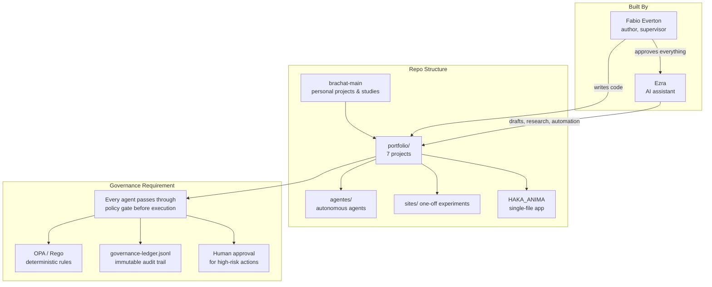
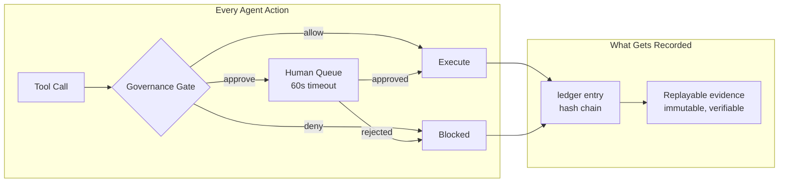
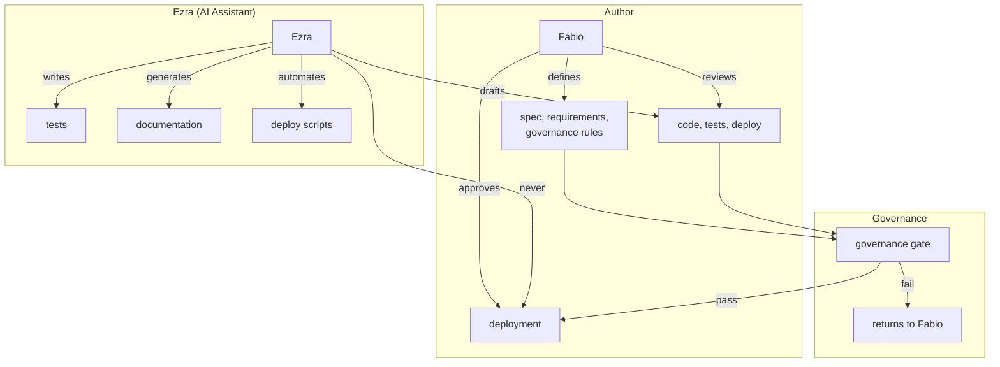
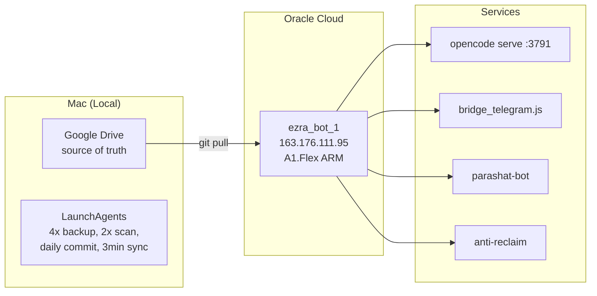

# brachat-main

**Personal projects and hands-on studies by Fabio Everton — AI agents, governance systems, and experiments. Built with Ezra (AI assistant) under his direct supervision. Nothing deploys without governance.**

## What This Repo Is

This is a **personal portfolio** of things I build and study: autonomous agents, RAG pipelines, governance experiments, and single-file apps. It is **not** client work and it is **not** a product catalog — commercial products (the [Ezra AI Governance Framework](https://github.com/FABIOEVERTON/EZRA_AI_GOVERNANCE_FRAMEWORK) and future SaaS) live in their own repositories. The common thread here: **runtime governance that cannot be bypassed**.

> **Honest framing:** every folder in this repo is work I did for myself — study projects, experiments and tools. No client contracts, no fake "portfolio" categories. What is sellable (the Ezra framework) has its own public repository.

## Runtime Governance — The Non-Negotiable

Every agent in this portfolio enforces the same rule: **if it cannot be audited, it cannot execute.**

This is not a feature. It is a constraint on architecture.

### Enforcement Rules

| Rule | Implementation |
|------|---------------|
| **Deterministic** | Authorization by code (OPA/Rego), never by LLM opinion |
| **Immutable** | SHA-256 hash chain on every decision entry |
| **Scoped** | Derived credential per task, not global access |
| **Rate-limited** | Anti-drip: max N destructive actions per time window |
| **Fail-closed** | If gate cannot decide → deny |
| **Auditable** | Full replay from ledger: who, what, when, outcome |

## Projects

| Project | Category | What It Demonstrates |
|---------|----------|---------------------|
| [**ezra_agent**](portfolio/agentes/ezra_agent) | Autonomous Agent | 24/7 Telegram agent with skills, memory, OCI deploy |
| [**ezra_curator**](portfolio/agentes/ezra_curator) | RAG | Corporate document RAG with reranking, fallbacks, citations |
| [**essay_creator**](portfolio/agentes/essay-creator) | Multi-Agent Pipeline | 5-agent LangGraph system with HITL and iterative refinement |
| [**exec-email-assistant**](portfolio/agentes/exec-email-assistant) | Multi-Agent Pipeline | Intent-based email routing with semantic memory |
| [**ezra_control_plane**](portfolio/agentes/ezra_control_plane) | Governance | Runtime gate that limits damage of compromised agents |
| [**agent_nice**](portfolio/agentes/agent_nice) | Autonomous Agent | Household governance with financial gates + self-evolution |
| [**parashat_bot**](portfolio/agentes/parashat_bot) | RAG + Bot | Weekly Torah study with NotebookLM + Groq |

> Hands-on research pipelines (LangChain/LangGraph) and full-stack experiments live in [fabio_studies](https://github.com/FABIOEVERTON/FABIOEVERTON) — study work stays out of this repo.

## How Projects Are Built

Every project follows this rule:
- **Fabio** writes specs, defines governance constraints, reviews code, approves deployment.
- **Ezra** drafts code, generates tests, automates ops — under Fabio's supervision.
- **Ezra never deploys independently.** Every deployment requires Fabio's explicit approval.

## Infrastructure

- **Compute**: Oracle Cloud A1.Flex (ARM, always-free tier)
- **Source of truth**: Google Drive → GitHub → VM
- **Secrets**: Never in git. `secrets.env` on Mac, `.env` on VM.
- **Backup**: rclone → Google Drive (4x/day)

## Tech Stack

| Category | Technologies |
|----------|--------------|
| **Languages** | Python · SQL · Rego · Bash · JavaScript · TypeScript |
| **Frameworks** | LangChain · LangGraph · FastAPI · NestJS · OpenCode |
| **AI/LLM** | OpenAI · Gemini · Cohere · Ollama · Groq · RAG |
| **Governance** | OPA/Rego · NIST AI RMF · EU AI Act · LGPD |
| **Infra** | Oracle Cloud (OCI) · Docker · PostgreSQL · pnpm |

## Contact

**Fabio Everton** — [jae.engenharia@gmail.com](mailto:jae.engenharia@gmail.com) · [LinkedIn](https://linkedin.com/in/fabioeverton) · [GitHub](https://github.com/FABIOEVERTON)

---

*Last updated: August 2026*
