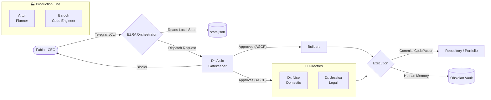

<div align="center">
  <h1>🌌 BRACHÁT ECOSYSTEM</h1>
  <p><strong>Personal AI Operating System & Multi-Agent Network</strong></p>
</div>

<br>

**BRACHÁT** is an autonomous, private ecosystem of Artificial Intelligence agents designed to govern daily routines, software engineering, financial automation, and knowledge management. Everything is supervised by a Strict Governance Director (Aísio) and orchestrated by a central intelligence (Ezra).

---

## 🚀 Data Pipeline & Execution Flow

The system architecture relies on strict approval and execution pipelines. Nothing happens without the governance gatekeeper's explicit approval.



---

## 🧠 Memory Architecture & Obsidian

The system is designed to save tokens while maintaining maximum efficiency. 
Instead of relying on extensive LLM context sweeps, the core uses `state.json` for low-cost machine memory, while specialized agents (like the software engineer **Baruch**) natively generate human-readable `DevLog.md` logs directly into the vault using the `obsidian-skills` library.


> This neural web interconnects every received ticket, every piece of code written by the engineer, and the orchestrator's approvals using native Wikilinks.

---

## 📂 System Architecture

The vault obeys a strict, noise-free hierarchical tree:

```text
brachat-main/
├── .cloud/                ← 24/7 Cron Scripts (LaunchAgents & Automations)
├── agents/                ← Core Brain: Ezra, Directors, and Studies
├── portfolio/engineer/    ← Baruch (Software Engineering Core)
├── integrations/          ← SSH keys and API integrations
├── branding/whatsapp/     ← Baileys Client
└── writings_studies/      ← Knowledge base and study schedules
```

---

## 🎛️ Dashboard & Infrastructure

While the agents work invisibly behind the scenes (running hidden scripts in `.cloud/`), you can monitor them in real-time through the VPS server or the web dashboard, which continuously reads the memory reports.


> *Dashboard operating on port 8080 reporting the Ezra, Aísio, and Baruch daemons in real-time.*

---

## 🛡️ Governance Layer (Zero-Trust)

- **No Cross-Domain Access:** A financial agent is not authorized to touch the engineering portfolio.
- **Manual Approval Required:** The orchestrator enters a suspended state and waits for Telegram authorization for significant transactions.
- **Commit Boundary:** The pipeline does not commit code that circumvents Aísio's approval.

---
*Ecosystem governed locally via AI Agent Specification.*
