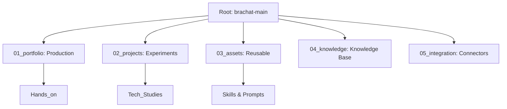

# brachat-main

A modular monorepo for AI systems, agent architectures, integrations, and structured knowledge.

---

## Overview

This repository is organized as a unified platform to support AI engineering, agent-based systems, and applied learning. It consolidates production-style components, experimental projects, reusable assets, and structured study material into a single architecture.

The goal is to maintain a **scalable, maintainable, and production-aligned monorepo** suitable for AI system development and governance-oriented architectures.

---

## 🏗️ System Architecture
Below is the representation of our modular structure using **Mermaid.js**:

---

## 01_portfolio

High-level systems designed for demonstration, architecture, and production-like structure.

- **Fellow Governance Platform**
  - Policy-driven architecture concepts
  - Backend + documentation + runbooks
  - Observability and governance modeling

- **Agent Architecture (Ezra)**
  - Modular AI agent system
  - Skills-based configuration
  - Runtime and memory structure

- **Trip Agent**
  - API-driven assistant example
  - External service integration patterns
    
- **ML_Productions**

---

## 02_projects

Applied experiments and learning implementations.

- Machine Learning studies (Zoomcamp, MLOps)
- AI architecture exploration
- Book/project prototypes (AISIO Book)
- Engineering practice environments

---

## 03_assets

Reusable building blocks shared across systems.

- **Skills System**
  - Prompt engineering templates
  - Agent behavior definitions
  - Modular skill definitions (YAML/Markdown)

- **Agent Assets**
  - Shared agent logic and runtime components
  - Configuration templates

- **Utility Scripts**
  - PDF processing tools
  - PPTX/XLSX automation tools
  - Web artifact builders
  - Skill generation tools

---

## 04_knowledge

Structured learning and external study material.

- English learning system
- Public subjects
- Technical notes and personal knowledge base
- Domain-specific research and summaries

This section is intentionally separated from production systems.

---

## 05_integration

Integration layer for external systems and APIs.

- API clients and connectors
- External service integrations
- Runtime interaction layers between agents and external systems

> **Note:** No secrets or credentials are stored in this repository. All sensitive data must be handled via environment variables (`.env`).

---

## Design Principles

- **Monorepo-first architecture**
- Clear separation between:
  - Production systems (portfolio)
  - Experimental work (projects)
  - Reusable logic (assets)
  - Knowledge (learning layer)
  - Integrations (external systems)
- Security-by-design (no secrets in version control)
- Modular agent-based structure

---

## Tech Stack

- Python
- YAML / Markdown-based configuration systems
- Docker (for platform components)
- API integrations (REST-based services)
- AI/LLM-driven agent frameworks

---

## Purpose

This repository is designed as a long-term engineering base for:

- AI agent systems
- Governance-oriented architectures
- Modular AI platforms
- Applied machine learning systems
- Engineering portfolio demonstration

---

🚀 Project Status
[Active Development] - We are continuously consolidating our agent governance structure.

---

## License

MIT License

Developed by Fabio | © 2026 MIT License

