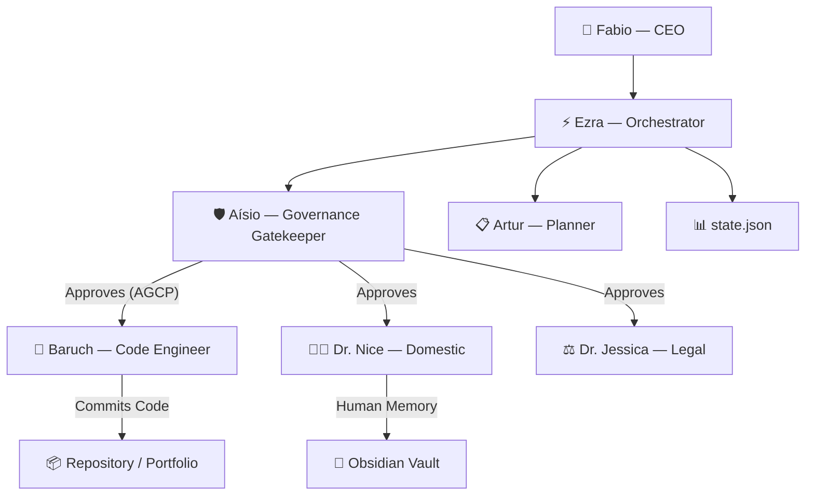

<h1 align="center">🌌 BRACHÁT ECOSYSTEM</h1>

<p align="center">
  <strong>Personal AI Operating System & Multi-Agent Network</strong><br/>
  <em>An autonomous, private ecosystem of AI agents governing daily routines, software engineering, financial automation, and knowledge management.</em>
</p>

<p align="center">
  
  
  
  
  
  
</p>

---

## 🏗️ Architecture



> **Zero-Trust Governance**: No agent crosses domain boundaries. Every significant action requires explicit approval through Aísio's gatekeeper pipeline (AGCP).

---

## 🤖 Agent Roster

| Agent | Role | Domain |
|-------|------|--------|
| **Ezra** | Central Orchestrator | Dispatches requests, reads `state.json`, coordinates all agents |
| **Aísio** | Governance Gatekeeper | Blocks/approves actions via AGCP protocol |
| **Baruch** | Software Engineer | Writes code, generates `DevLog.md`, commits to repo |
| **Artur** | Planner | Breaks tasks into structured execution plans |
| **Dr. Nice** | Domestic Director | Household automation, shopping, pantry management |
| **Dr. Jessica** | Legal Director | Legal operations and compliance |

---

## 📂 Repository Structure

```
brachat-main/
├── agents/                    # Core brain: Ezra, Directors, certifications
│   ├── orchestrator/          # Ezra's configs, schedules, job agent
│   │   ├── ezra/              # persona, skills, startup, job pipeline
│   │   └── certifications/    # Certs, hermes_agent (self-evolution)
│   └── launchd/               # macOS daemon logs
├── portifolio/                # Showcase projects
│   ├── essay-creator/         # ✍️  Multi-agent essay pipeline (LangGraph + HITL)
│   ├── exec-email-assistant/  # 📧 Email AI with semantic memory (langmem)
│   ├── langchain_hands_on/    # 🔗 LangChain multi-agent RAG system
│   └── langraph_hands_on/     # 📊 LangGraph stateful workflow engine
└── opencode.json              # AI agent configuration
```

---

## 🚀 Portfolio Projects

### ✍️ Multi-Agent Essay Creator
> 5 agents (Planner → Researcher → Writer → Reflector → Critic) in a cyclic LangGraph workflow with SQLite persistence and Gradio UI.

- **HITL**: `interrupt_before=["critic"]` — pause, inspect snapshot, inject overrides
- **Persistence**: SQLite via `SqliteSaver` keyed by `thread_id`
- **Tech**: LangGraph, Gemini 2.0 Flash, Gradio, custom `reduce_messages`

### 📧 Executive Email Assistant
> Intent-based email triage with semantic memory and human-in-the-loop scheduling.

- **Semantic Memory**: `InMemoryVectorStore` with `GoogleGenerativeAIEmbeddings`
- **5 Agents**: Classifier → Memory Search → Draft Reply / Schedule / Archive
- **langmem Tools**: `create_manage_memory_tool` + `create_search_memory_tool`
- **HITL**: Pauses before calendar scheduling for human approval

### 🔗 AI Research Analyst (LangChain)
> Multi-agent RAG system: Researcher → Analyst → Reviewer → Writer with CLI and confidence scoring.

### 📊 LangGraph Multi-Agent System
> Stateful research engine with conditional routing, persistent state, and cycle detection.

---

## 🛡️ Governance Layer (Zero-Trust)

- **No Cross-Domain Access**: Financial agents cannot touch engineering portfolio
- **Manual Approval Required**: Orchestrator suspends and waits for Telegram authorization
- **Commit Boundary**: Pipeline does not commit code that circumvents Aísio's approval
- **MVI Hook**: Pre-commit governance enforces ≤200 lines per tracked file

---

## ⚙️ Tech Stack

| Layer | Technology |
|-------|-----------|
| LLM | Google Gemini 2.0 Flash |
| Orchestration | LangGraph (StateGraph, checkpointers) |
| Memory | langmem, InMemoryVectorStore, SQLite |
| UI | Gradio (4-tab interfaces) |
| Email | Gmail API via Composio, Spark (Mac) |
| Scheduling | Google Calendar API |
| Scraping | Playwright, BeautifulSoup |
| CLI | Typer + Rich |
| Governance | Custom pre-commit hook (MVI ≤200 lines) |

---

## 🚀 Quick Start

```bash
git clone https://github.com/FABIOEVERTON/BRACHAT-MAIN.git
cd BRACHAT-MAIN

# Portfolio projects
cd portifolio/essay-creator
pip install -e .
python -m essay_creator.app  # Opens Gradio UI

# Email assistant
cd ../exec-email-assistant
pip install -e .
python -m email_assistant.app
```

---

<p align="center">
  <em>Ecosystem governed locally via AI Agent Specification.</em><br/>
  <strong>Fabio Everton</strong> — <a href="mailto:jae.engenharia@gmail.com">jae.engenharia@gmail.com</a> · <a href="https://linkedin.com/in/jae">LinkedIn</a> · <a href="https://portfolio-jae.netlify.app">Portfolio</a>
</p>
