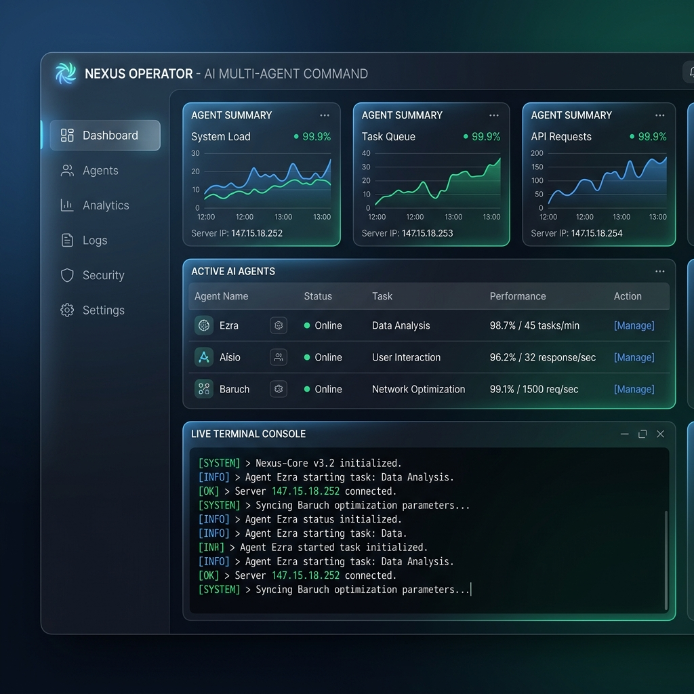

<div align="center">
  <h1>🌌 BRACHÁT ECOSYSTEM</h1>
  <p><strong>Personal AI Operating System & Multi-Agent Network</strong></p>
</div>

<br>

O **BRACHÁT** é um ecossistema autônomo e privado de agentes de Inteligência Artificial desenhado para governar rotinas, engenharia de software, automação financeira e gestão de conhecimento. Tudo supervisionado por um Diretor de Governança Estrito (Aísio) e orquestrado por uma inteligência central (Ezra).

---

## 🚀 Como o Fluxo Funciona (Data Pipeline)

A arquitetura do sistema funciona com pipelines rigorosos de aprovação e execução. Nada acontece sem o aval da governança.

```mermaid
graph LR
    User([Fábio - CEO]) -- Telegram/CLI --> EZRA{EZRA Orchestrator}
    EZRA -- Lê Estado Local --> State[(state.json)]
    
    EZRA -- Solicita Despacho --> AISIO[Dr. Aísio <br> Gatekeeper]
    AISIO -- Bloqueia --> User
    
    AISIO -- Aprova (AGCP) --> Directors
    AISIO -- Aprova (AGCP) --> Builders
    
    subgraph 🏰 Diretores
    NICE[Dr. Nice <br> Domestic]
    JESSICA[Dr. Jessica <br> Legal]
    end

    subgraph 🏭 Linha de Produção
    ARTUR[Artur <br> Planner]
    BARUCH[Baruch <br> Code Engineer]
    end
    
    Directors --> Exec{Execução}
    Builders --> Exec
    
    Exec -- Registra Código/Ação --> Github[Repositório / Portfólio]
    Exec -- Memória Humana --> Obsidian[(Obsidian Vault)]
```

---

## 🧠 Arquitetura de Memória & Obsidian

O sistema foi desenhado para economizar tokens mantendo eficiência máxima. 
Em vez de depender de extensas varreduras de LLM, o cérebro usa `state.json` para memória de máquina de baixo custo, enquanto os agentes (como o engenheiro **Baruch**) geram nativamente o `DevLog.md` usando a biblioteca `obsidian-skills`.


> Essa teia neural interliga cada ticket recebido, cada código feito pelo engenheiro e o aval do orquestrador usando Wikilinks nativos.

---

## 📂 Organização Diretorial

O cofre obedece a uma árvore hierárquica estrita e sem ruídos:

```text
brachat-main/
├── .cloud/                ← Scripts Cron 24/7 (LaunchAgents)
├── agents/                ← Cérebro: Ezra, Diretores e Estudos
├── portfolio/engineer/    ← Baruch (Engenharia de Software)
├── integrations/          ← Chaves SSH e serviços de API
├── branding/whatsapp/     ← Baileys Client
└── writings_studies/      ← Base de conhecimento e cronogramas
```

---

## 🎛️ Dashboard & Infraestrutura

Enquanto os agentes trabalham de forma invisível nos bastidores (rodando scripts ocultos em `.cloud/`), você pode acompanhar em tempo real através do servidor VPS ou painel de controle que roda os relatórios contínuos de memória.



> *Dashboard operando na porta 8080 reportando os Daemons Ezra, Aísio e Baruch em tempo real.*

---

## 🛡️ Camada de Governança (Zero-Trust)

- **Sem Cross-Domain:** Um agente financeiro não tem autorização para tocar no portfólio.
- **Aprovação Manual:** O orquestrador entra em suspensão e aguarda autorização no Telegram para compras acima de R$500.
- **Commit Boundary:** O pipeline não faz commits de código que fujam da aprovação do Aísio.

---
*Ecossistema governado localmente via AI Agent Specification.*
