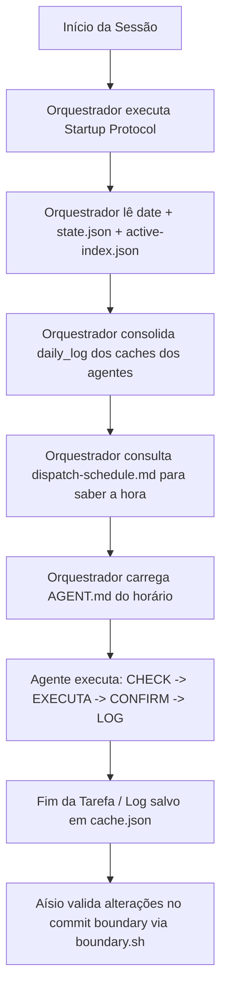

# Auditoria e Descoberta — Ecossistema BRACHÁT (07/06/2026)

Este relatório apresenta os resultados da auditoria estrutural e funcional completa realizada no repositório `brachat-main`. O objetivo é identificar quebras de integridade, inconsistências de documentação, ineficiências na economia de tokens e oportunidades de otimização operacional.

---

## 1. SYSTEM MAP — all agents, their declared roles, orchestration flow

O ecossistema **BRACHÁT** é estruturado em três camadas de execução de agentes com diferentes níveis de temperatura e capacidades cognitivas (raciocínio/reasoning), coordenadas por um orquestrador central.

### Orquestrador
* **Função Declarada:** Dispatcher puro (temperatura 0, sem reasoning). É responsável por inicializar a sessão (startup protocol), ler os estados, os logs dos agentes diários e fazer a chamada de execução para o agente do respectivo horário.
* **Arquivos do Prompt:**
  * [orquestrador.md](file:///Users/mac/brachat-main/assistant_agents/.opencode/agent/orquestrador.md) (versão principal em inglês/português com frontmatter).
  * [AGENT.md](file:///Users/mac/brachat-main/assistant_agents/orquestrador/AGENT.md) (versão em português simplificada).

### Camada 1: Daily Agents (12 declarados, 11 implementados fisicamente)
Agentes focados em rotinas diárias específicas do usuário. Operam com temperatura moderada (0.2 a 0.3) para preparar materiais ou com temperatura zero (zero reasoning) para tarefas de produção determinísticas.

1. **ingles** ([daily/ingles/AGENT.md](file:///Users/mac/brachat-main/assistant_agents/daily/ingles/AGENT.md)): Tutor de inglês técnico via *C2 Intelligence Briefing Framework*.
2. **torah** ([daily/torah/AGENT.md](file:///Users/mac/brachat-main/assistant_agents/daily/torah/AGENT.md)): Estudo diário da Torá (parashá semanal, reflexão e conexões éticas).
3. **filosofia** ([daily/filosofia/AGENT.md](file:///Users/mac/brachat-main/assistant_agents/daily/filosofia/AGENT.md)): Estudo de correntes filosóficas e diálogos socráticos.
4. **certificacoes** ([daily/certificacoes/AGENT.md](file:///Users/mac/brachat-main/assistant_agents/daily/certificacoes/AGENT.md)): Estudo guiado para certificações de nuvem (AWS/GCP/Azure).
5. **google-skills** ([daily/google-skills/AGENT.md](file:///Users/mac/brachat-main/assistant_agents/daily/google-skills/AGENT.md)): Cobrança e processamento de cursos do *Google Skills Boost*.
6. **python** ([daily/python/AGENT.md](file:///Users/mac/brachat-main/assistant_agents/daily/python/AGENT.md)): Mentor e revisor de código para o curso *Python Masterclass*.
7. **portfolio** ([daily/portfolio/AGENT.md](file:///Users/mac/brachat-main/assistant_agents/daily/portfolio/AGENT.md)): Conversão dos aprendizados do dia em rascunhos de posts para o LinkedIn.
8. **job-hunter** ([daily/job-hunter/AGENT.md](file:///Users/mac/brachat-main/assistant_agents/daily/job-hunter/AGENT.md)): Scanner de vagas de emprego (LinkedIn, Indeed, Gupy, GeekHunter) - T°0.
9. **freelancer** ([daily/freelancer/AGENT.md](file:///Users/mac/brachat-main/assistant_agents/daily/freelancer/AGENT.md)): Busca de projetos freela (Workana, Upwork, 99Freelas) e geração de propostas - T°0.
10. **pmp** ([daily/pmp/AGENT.md](file:///Users/mac/brachat-main/assistant_agents/daily/pmp/AGENT.md)): Tutor para certificação *Project Management Professional (PMP)*.
11. **ml-engineer** ([daily/ml-engineer/AGENT.md](file:///Users/mac/brachat-main/assistant_agents/daily/ml-engineer/AGENT.md)): Tutor para a trilha de Engenharia de Machine Learning.
12. **nice** ([daily/nice/AGENT.md](file:///Users/mac/brachat-main/assistant_agents/daily/nice/AGENT.md)): Governança doméstica (compras, contas, agenda da Dona Lu).

*Nota: O agente de rastreamento de progresso de estudos (`estudos`) é mencionado e lido pelo orquestrador, mas não possui arquivo prompt `AGENT.md` físico. Seu estado é atualizado apenas via cache.json.*

### Camada 2: Directors (5 declarados, 5 implementados fisicamente)
Agentes supervisores com papéis de direção de negócios e governança estratégica.

1. **josue** ([directors/josue/AGENT.md](file:///Users/mac/brachat-main/assistant_agents/directors/josue/AGENT.md)): Diretor Executivo & Comercial (orquestração comercial, novos clientes).
2. **gilmario** ([directors/gilmario/AGENT.md](file:///Users/mac/brachat-main/assistant_agents/directors/gilmario/AGENT.md)): Diretor de Ensino, Branding & Autoridade Acadêmica.
3. **aisio** ([directors/aisio/AGENT.md](file:///Users/mac/brachat-main/assistant_agents/directors/aisio/AGENT.md)): Diretor de Governança, Compliance & Auditoria (enforcement de frameworks e políticas).
4. **jessica** ([directors/jessica/AGENT.md](file:///Users/mac/brachat-main/assistant_agents/directors/jessica/AGENT.md)): Diretora Jurídica (memória isolada por sigilo profissional).
5. **nice** ([directors/nice/AGENT.md](file:///Users/mac/brachat-main/assistant_agents/directors/nice/AGENT.md)): Governança Doméstica Completa.

### Orchestration Flow
O fluxo operacional diário baseia-se na rotina agendada no `state.json` e regulada pelo cronograma unificado (`official_schedule.md`).

---

## 2. INTEGRITY — broken references, rule conflicts, undefined agents

### Referências Quebradas (Broken References)
1. **Caminho do Estado Canônico (`state.json`):**
   * O arquivo [TUTORIAL.md](file:///Users/mac/brachat-main/TUTORIAL.md) (linha 203) aponta o `state.json` canônico para `assistant_agents/substracts/state.json`.
   * A pasta `substracts` não existe fisicamente no repositório. O arquivo de fato está em `assistant_agents/state.json`.
2. **Estados Locais Inexistentes:**
   * O [state.json](file:///Users/mac/brachat-main/state.json) raiz e o de `assistant_agents` listam no array `"folder_states"` caminhos inexistentes: `Branding/state.json`, `Portifolio/builder_agents/state.json` e `Studies/state.json`.
3. **Referências de Governança no Prompt de Aísio:**
   * O prompt de Aísio ([directors/aisio/AGENT.md](file:///Users/mac/brachat-main/assistant_agents/directors/aisio/AGENT.md) na linha 25) referencia os caminhos `governance/AGCP.md`, `governance/QILIS.md`, `governance/REGULATORY.md` e `governance/DEVSECOPS.md`.
   * Fisicamente, a pasta `governance/` na raiz de `assistant_agents` não existe; esses arquivos estão sob `assistant_agents/shared/governance/`.
4. **Referência de Schedule em `writings_studies/README.md`:**
   * O arquivo [writings_studies/README.md](file:///Users/mac/brachat-main/writings_studies/README.md) (linha 31) refere-se ao cronograma em `professional_trail/schedule-updated.md`.
   * Essa pasta e arquivo não existem fisicamente. O cronograma correto é [official_schedule.md](file:///Users/mac/brachat-main/writings_studies/official_schedule.md).

### Conflito de Regras (Rule Conflicts)
1. **Persistência de Cache:**
   * O arquivo de regras gerais [REGRAS.md](file:///Users/mac/brachat-main/assistant_agents/REGRAS.md) (linha 80) determina: *"Cache expira a cada sessão (não persistir entre sessões)"*.
   * Porém, a documentação geral do [TUTORIAL.md](file:///Users/mac/brachat-main/TUTORIAL.md) (linha 29) e as diretrizes explícitas inseridas no topo dos arquivos `cache.json` individuais (como em `job-hunter/cache.json` e `freelancer/cache.json`) dizem: *"Tracker persistente por dia. NUNCA resetar"*.
   * Se o cache for limpo a cada sessão, o orquestrador perde a capacidade de saber o que foi entregue ou skipado no dia anterior, quebrando o ciclo de progressão de estudos.

### Agentes Indefinidos (Undefined Agents)
1. **Gerentes de Gilmário:** O prompt de Gilmário (`directors/gilmario/AGENT.md`) declara que ele delega tarefas para 4 gerentes subordinados: `brand`, `est_ceo`, `est_tuco` e `lit`. Nenhum desses agentes ou prompts existe no repositório.
2. **Gerentes de Josué:** O prompt de Josué (`directors/josue/AGENT.md`) declara gerenciar 4 subordinados: `deliv` (delivery), `fin` (finanças), `cli` (clientes) e `exec`. Nenhum existe fisicamente.
3. **Gerentes de Jéssica:** O prompt de Jéssica (`directors/jessica/AGENT.md`) declara gerenciar 3 subordinados: `con_jur`, `ris_jur` e `int_jur`. Nenhum existe fisicamente.
4. **Gerentes de Aísio:** O prompt de Aísio (`directors/aisio/AGENT.md`) declara gerenciar 4 subordinados: `log`, `security`, `compliance` e `access control`. Nenhum existe fisicamente.
5. **Agente de Estudos:** Não há um arquivo prompt `daily/estudos/AGENT.md`, embora `daily/estudos/cache.json` exista e seja ativamente lido e manipulado pelo orquestrador.

---

## 3. CONSISTENCY — docs vs implementation gaps, naming inconsistencies

### Gaps de Implementação (Docs vs Implementation Gaps)
1. **Infraestrutura Inexistente do Construtor de Software:**
   * O arquivo [assistant_agents/README.md](file:///Users/mac/brachat-main/assistant_agents/README.md) descreve detalhadamente uma infraestrutura inteira localizada em `/Users/mac/brachat_builder/` contendo scripts daemon, hooks de git e pontes WebSocket (`clickup_daemon.py`, `bot_hermes.py`, `lazy-gravity-suite/`).
   * **Este diretório `/Users/mac/brachat_builder/` não existe no Mac do usuário e nenhum desses daemons/scripts está no repositório.** Os scripts reais de bridge do Telegram estão em `assistant_agents/shared/general_scripts/` e operam de forma simplificada.
2. **Uso Teórico do Ledger de Governança:**
   * Aísio e o script [boundary.sh](file:///Users/mac/brachat-main/assistant_agents/shared/governance/boundary.sh) exigem que qualquer ação passe por validação commit-bound e que a ausência do registro `AUTHORIZED` no `governance-ledger.jsonl` resulte em bloqueio imediato (deny).
   * O arquivo [governance-ledger.jsonl](file:///Users/mac/brachat-main/assistant_agents/.opencode/governance-ledger.jsonl) está totalmente vazio, indicando que o sistema de segurança lógica não está ativo na prática.
3. **Status do Agente de Filosofia:**
   * O `state.json` principal (linhas 219 e 248) define o prompt do agente de Filosofia como pendente de roteiro pelo usuário. Entretanto, o arquivo `daily/filosofia/AGENT.md` já está totalmente implementado e estruturado.

### Inconsistências de Nomenclatura (Naming Inconsistencies)
1. **Portifolio vs Portfolio:** O diretório físico na raiz do repositório está grafado com erro ortográfico (`Portifolio`), mas no `TUTORIAL.md` e em partes do `state.json` ele é referido como `Portfolio`.
2. **Studies vs writings_studies:** O `README.md` principal (linha 8) e o `state.json` raiz (linha 7) declaram a pasta de estudos como `Studies/`. No entanto, fisicamente o diretório chama-se `writings_studies/`.
3. **Operational_Agents vs assistant_agents:** O `README.md` principal (linha 7) cita que a pasta dos agentes é `Operational_Agents/`, mas a pasta real chama-se `assistant_agents/`.
4. **Metadados Inconsistentes no `active-index.json`:**
   * Jéssica (Diretora Jurídica com isolamento estrito de memória) está categorizada com as tags `["comunicacao", "marketing"]`.
   * Josué (Diretor Executivo & Comercial) está com as tags `["dev", "tecnico"]`.
   * Gilmário (Diretor de Ensino, Branding & Autoridade) está com as tags `["estrategia", "negocios"]`.
   Essas categorizações de tags chocam diretamente com a função descrita em seus prompts individuais.

---

## 4. TOKEN ECONOMY — duplicate rules, verbose prompts, redundant memory

### Prompts e Arquivos Duplicados
1. **Nice Duplicada:** Existem duas definições de prompt idênticas em escopo para a governança doméstica: `daily/nice/AGENT.md` (56 linhas) e `directors/nice/AGENT.md` (73 linhas). Elas divergem na especificação do canal de comunicação (uma cita Telegram, outra WhatsApp) e na quantidade de regras.
2. **Orquestrador Duplicado:**
   * O arquivo `.opencode/agent/orquestrador.md` (57 linhas) e o `orquestrador/AGENT.md` (40 linhas) são ambos prompts para o orquestrador, contendo descrições e tabelas de dispatch ligeiramente diferentes. A coexistência dos dois gera desperdício de contexto no ecossistema OpenCode.
3. **Duplicação de `state.json`:** Há arquivos `state.json` espalhados pelo repositório (na raiz, em `assistant_agents/`, `writings_studies/` e `Portifolio/`). O startup protocol exige a leitura de múltiplos arquivos de estado, o que gera redundância severa e desperdício de tokens, além de risco alto de dessincronização de dados.

### Prompts Longos (Verbose Prompts)
* O prompt de Nice (`directors/nice/AGENT.md` com 73 linhas) viola a restrição explícita de `REGRAS.md` (linha 69) que determina: *"Prompts <60 linhas"*.

### Memória Redundante (Redundant Memory)
* **Desativação do Mem0 vs Uso nos Prompts:** O arquivo `state.json` canônico (linha 27) define a remoção do backend Mem0 (`"persistent_memory_backend": "state.json (single canonical file, mem0 deleted)"`).
* No entanto, o `RULE[user_global]` inserido no sistema e os prompts de Nice (`directors/nice/AGENT.md` na linha 53) exigem explicitamente o uso do Mem0 para gravar fatos permanentes e preferências da Dona Lu. Isso gera instruções redundantes e contraditórias que confundem a tomada de decisão do LLM.

---

## 5. EFFICIENCY — unnecessary agent hops, missing parallelism, circular dependencies

### Saltos Desnecessários de Agentes (Unnecessary Agent Hops)
* Devido à separação estrita entre o Orquestrador (dispatch puro) e os Daily Agents, a execução de qualquer tarefa trivial consome pelo menos dois ciclos de chamada de LLM (Orquestrador interpreta o horário -> chama o agente correspondente que carrega outro prompt -> o agente executa). Uma arquitetura com roteamento simplificado economizaria uma chamada inteira de LLM por slot de horário.

### Falta de Paralelismo
* O processamento de cronogramas e monitoramento de vagas é estritamente sequencial. O orquestrador opera de forma linear, impedindo a IA de rodar varreduras ou estudos em segundo plano de forma paralela (a menos que dependa puramente do `launchd` executando scripts externos de Python, nos quais a IA não tem controle direto).

### Dependências Circulares (Circular Dependencies)
1. **Loop do Telefone WhatsApp Business:**
   * No arquivo `Branding/contacts.json`, o número de WhatsApp cadastrado como o emissor do robô (Business) é `5561996506881`.
   * Esse mesmo número está cadastrado no contato de Fábio Everton (id: `fabio`), proprietário e destinatário das mensagens do sistema.
   * **Impacto:** Isso gera um loop circular onde o bot tenta enviar mensagens e alertas para si mesmo via API de WhatsApp Business, o que pode causar travamento, mensagens duplicadas ou bloqueio de conta.
2. **Orquestrador vs Aísio:** O Orquestrador precisa carregar Aísio para validar ações no commit boundary, mas Aísio é dependente do orquestrador para obter seu dispatch e ler seus metadados de execução, criando um forte acoplamento de dependências.

---

## 6. CRITICAL FINDINGS — prioritized list

Abaixo estão listadas as principais falhas e inconsistências categorizadas por severidade, com suas respectivas localizações, impacto e ações recomendadas.

### 🔴 CRITICAL

#### 1. Loop de Mensagens no WhatsApp
* **Localização:** [Branding/contacts.json](file:///Users/mac/brachat-main/Branding/contacts.json) (linhas 3 e 12)
* **Descrição:** O número de WhatsApp cadastrado como o canal oficial de saída do Business (`5561996506881`) é idêntico ao cadastrado para o contato pessoal de Fábio.
* **Impacto:** Possibilidade de loop de envio infinito ou falha de comunicação onde o robô se auto-envia mensagens e não alcança o terminal físico real do usuário.
* **Ação Recomendada:** Atualizar o WhatsApp de Fábio em `contacts.json` para o número correto declarado no `state.json` canônico (`5561998743226`) e separar as identidades.

#### 2. Ausência Física do Diretório do Construtor de Software
* **Localização:** [assistant_agents/README.md](file:///Users/mac/brachat-main/assistant_agents/README.md) (linhas 11-35)
* **Descrição:** A documentação de operação descreve um diretório `/Users/mac/brachat_builder/` contendo scripts e daemons fundamentais (`clickup_daemon.py`, `bot_hermes.py`, `lazy-gravity-suite/`), mas este diretório não existe no Mac do usuário.
* **Impacto:** Os agentes que tentarem ler ou executar ferramentas a partir desse README falharão por falta dos arquivos físicos na máquina.
* **Ação Recomendada:** Remover referências a `/Users/mac/brachat_builder/` e seus scripts inexistentes ou migrar os códigos de operação reais para dentro do repositório `brachat-main`.

#### 3. Referência a 15 Agentes Inexistentes
* **Localização:**
  * [directors/gilmario/AGENT.md](file:///Users/mac/brachat-main/assistant_agents/directors/gilmario/AGENT.md) (linha 25)
  * [directors/josue/AGENT.md](file:///Users/mac/brachat-main/assistant_agents/directors/josue/AGENT.md) (linha 25)
  * [directors/jessica/AGENT.md](file:///Users/mac/brachat-main/assistant_agents/directors/jessica/AGENT.md) (linha 25)
  * [directors/aisio/AGENT.md](file:///Users/mac/brachat-main/assistant_agents/directors/aisio/AGENT.md) (linha 38)
* **Descrição:** Os prompts dos Diretores descrevem a delegação de tarefas para um total de 15 agentes gerentes subordinados (`brand`, `est_ceo`, `deliv`, `fin`, `con_jur`, etc.) que não existem no repositório.
* **Impacto:** Quando os Diretores tentam delegar tarefas, geram falhas em cascata ou tentam inventar/chamar agentes fantasmas.
* **Ação Recomendada:** Reescrever os prompts dos Diretores para remover referências a gerentes inexistentes, consolidando suas tarefas diretamente nos Daily Agents ou simplificando as cadeias de delegação.

---

### 🟡 HIGH

#### 4. Caminho do Estado Canônico Incorreto
* **Localização:** [TUTORIAL.md](file:///Users/mac/brachat-main/TUTORIAL.md) (linha 203)
* **Descrição:** O tutorial inicial aponta o caminho do estado para `assistant_agents/substracts/state.json`.
* **Impacto:** Novos agentes iniciados na sessão tentam carregar o estado a partir de uma pasta inexistente (`substracts`), resultando em erros imediatos de "File Not Found".
* **Ação Recomendada:** Ajustar a linha 203 do `TUTORIAL.md` para apontar para o caminho real: `assistant_agents/state.json`.

#### 5. Prompts Duplicados e Conflitantes de Nice
* **Localização:** [daily/nice/AGENT.md](file:///Users/mac/brachat-main/assistant_agents/daily/nice/AGENT.md) e [directors/nice/AGENT.md](file:///Users/mac/brachat-main/assistant_agents/directors/nice/AGENT.md)
* **Descrição:** Nice está duplicada como Daily Agent e como Diretora. Suas regras divergem sobre o canal oficial de comunicação (Telegram vs WhatsApp) e tamanho do prompt.
* **Impacto:** Consumo desnecessário de tokens de contexto, além de comportamento inconsistente (o robô pode usar Telegram em uma chamada e WhatsApp em outra).
* **Ação Recomendada:** Excluir a cópia duplicada em `daily/nice/` e manter Nice apenas como Diretora em `directors/nice/`, atualizando a tabela de dispatch para refletir o caminho correto.

#### 6. Duplicação de Prompts do Orquestrador
* **Localização:** [orquestrador/AGENT.md](file:///Users/mac/brachat-main/assistant_agents/orquestrador/AGENT.md) e [.opencode/agent/orquestrador.md](file:///Users/mac/brachat-main/assistant_agents/.opencode/agent/orquestrador.md)
* **Descrição:** Dois prompts do Orquestrador coexistem com tabelas de rotinas e regras ligeiramente diferentes.
* **Impacto:** Confusão de contexto no OpenCode e carregamento de prompts obsoletos.
* **Ação Recomendada:** Consolidar as regras e a tabela de dispatch em um único arquivo de prompt no caminho oficial e remover a duplicata.

---

### 🟢 MEDIUM

#### 7. Ledger de Governança Vazio
* **Localização:** [governance-ledger.jsonl](file:///Users/mac/brachat-main/assistant_agents/.opencode/governance-ledger.jsonl)
* **Descrição:** O arquivo de registros do compliance está totalmente vazio, enquanto o prompt de Aísio exige a leitura do log `AUTHORIZED` para validação de ações.
* **Impacto:** Incoerência de comportamento onde o compliance lógico é simulado nos prompts mas desconsiderado na execução real.
* **Ação Recomendada:** Habilitar a escrita do output do `boundary.sh` ou remover a obrigatoriedade de leitura do ledger nos prompts enquanto o sistema de logs não estiver populado.

#### 8. Inconsistência de Tags e Metadados dos Diretores
* **Localização:** [active-index.json](file:///Users/mac/brachat-main/assistant_agents/skills-cache/active-index.json) (linhas 19-22)
* **Descrição:** Os diretores Josué, Jéssica e Gilmário estão associados a tags que não correspondem aos seus papéis reais (Ex: Jéssica Jurídica sob "comunicacao" e "marketing").
* **Impacto:** Classificação errônea nas buscas de skills do ecossistema e carregamento desnecessário de contextos jurídicos para tarefas de marketing ou vice-versa.
* **Ação Recomendada:** Ajustar as tags no `active-index.json` para refletir estritamente as competências de cada diretor.

#### 9. Erro de Grafia de Pastas (Portifolio vs Writings_Studies)
* **Localização:** Raiz do Repositório (`README.md`, `state.json`)
* **Descrição:** O repositório possui a pasta física `Portifolio` (com 'i'), mas as referências no código usam `Portfolio`. Adicionalmente, as referências de documentação chamam a pasta física `writings_studies` de `Studies`.
* **Impacto:** Falhas em scripts de automação que tentam acessar caminhos de diretório hardcoded usando a grafia correta em inglês.
* **Ação Recomendada:** Corrigir a grafia da pasta física para `portfolio` (ou atualizar todas as referências para `Portifolio`) e alinhar o nome de `writings_studies` com as declarações de `Studies` nos READMEs.

---

### 🔵 LOW

#### 10. Tamanho do Prompt de Nice Excedido
* **Localização:** [directors/nice/AGENT.md](file:///Users/mac/brachat-main/assistant_agents/directors/nice/AGENT.md)
* **Descrição:** O prompt possui 73 linhas, excedendo o limite estrito de 60 linhas definido em `REGRAS.md`.
* **Impacto:** Pequeno desperdício de tokens de contexto durante a chamada do agente.
* **Ação Recomendada:** Comprimir e refatorar as linhas redundantes do prompt para trazê-lo abaixo do teto de 60 linhas.

#### 11. Conflito sobre o Backend Mem0
* **Localização:** [state.json](file:///Users/mac/brachat-main/assistant_agents/state.json) (linha 27) e [REGRAS.md](file:///Users/mac/brachat-main/assistant_agents/REGRAS.md)
* **Descrição:** O estado declara o backend Mem0 como deletado, enquanto as instruções globais do usuário e os prompts de Nice continuam exigindo o uso de gravação/leitura no Mem0.
* **Impacto:** Execuções de chamadas de API inválidas para o serviço Mem0 ou armazenamento inconsistente de informações.
* **Ação Recomendada:** Homogeneizar a regra: ou o Mem0 é desativado em todo o ecossistema ou reintroduzido como o backend oficial de fatos permanentes.
