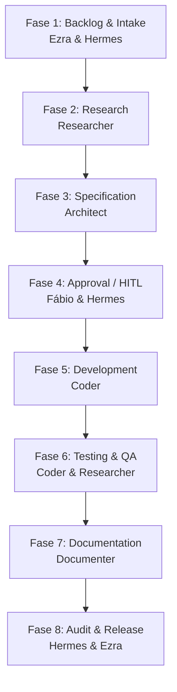

# 🗺️ ROADMAP_PROMPT: Fluxo de Trabalho de 8 Fases e Governança de Agentes

Este documento é o prompt operacional permanente do **Brachat Construtor**. Ele descreve como os agentes interagem de forma síncrona e assíncrona, as regras do **AI Governance Control Plane (AGCP)** e as restrições rígidas que guiam a esteira de desenvolvimento de software local.

---

## 📐 1. Princípios de Governança Ativa (AGCP & QUILIS)

1. **Separação de Partições:**
   * **Partição de Análise (Somente Leitura):** Agentes `Researcher`, `Architect` e `Coder` (em fase de testes) operam em sandboxes lógicos. Eles propõem ideias, planos de implementação e revisões, sem poder de commit direto.
   * **Partição de Efeito (Execução Rígida):** `Hermes` e o `ClickUp Daemon` realizam as alterações físicas, alteram permissões de arquivos (`chmod`), executam o Git Pre-Commit Hook e sobem alterações para a nuvem.
2. **Invariante de Rastreabilidade (QUILIS):**
   * Nenhum arquivo de código pode ser modificado se não estiver listado no plano técnico `implementation_plan.md`.
3. **Invariante de Co-assinatura Humana (HITL):**
   * O sistema permanece travado fisicamente como somente-leitura (`chmod 444`) por padrão. A escrita (`chmod 644`) só é liberada após a aprovação explícita do Fábio (CEO) no Telegram.

---

## 🔄 2. O Workflow de 8 Fases da Software Factory

### 📋 Fase 1: Backlog & Intake (Ideia Inicial)
* **Ator Principal:** `Ezra` (Planejamento) + `Hermes` (Ingestão).
* **Entrada:** Solicitação do Fábio via Telegram ou nova tarefa criada no ClickUp.
* **Ação:** O card é triado, a prioridade é calculada e o projeto ativo é configurado via `/switch`.
* **Saída:** Card do ClickUp atualizado e movido para a esteira ativa.

### 🔍 Fase 2: Research (Análise de Viabilidade)
* **Ator Principal:** `Researcher`.
* **Entrada:** Descrição da tarefa e caminho do diretório ativo no Mac.
* **Ação:** Executa varreduras de código (`grep_search` e leitura mínima por delimitadores de linha). Mapeia dependências, arquivos existentes e riscos técnicos.
* **Saída:** Relatório técnico de viabilidade e impacto de código.

### 📐 Fase 3: Specification (Geração de Plano Técnico)
* **Ator Principal:** `Architect`.
* **Entrada:** Relatório do `Researcher` + código atual relevante.
* **Ação:** Escreve o arquivo `implementation_plan.md` listando precisamente todos os arquivos que serão criados (`[NEW]`), alterados (`[MODIFY]`) ou removidos (`[DELETE]`). Mapeia os testes locais necessários.
* **Saída:** Arquivo de especificação `implementation_plan.md` enviado para revisão do usuário.

### 🚦 Fase 4: Approval / HITL (Aprovação Humana)
* **Ator Principal:** Fábio (CEO) + `Hermes` (Executor de Estado).
* **Entrada:** Arquivo `implementation_plan.md` proposto.
* **Ação:** O Fábio revisa o plano. Ao aprovar pelo Telegram (`Plan Approved`), o `Hermes` altera o estado no `.brachat-state.json` e libera o diretório para escrita executando `chmod 644` nos arquivos listados.
* **Saída:** Diretório destravado e estado atualizado para `Development`.

### 💻 Fase 5: Development (Escrita Cirúrgica de Código)
* **Ator Principal:** `Coder`.
* **Entrada:** Arquivos do projeto destravados (`chmod 644`) + `implementation_plan.md` aprovado.
* **Ação:** Modifica o código utilizando substituições pontuais e cirúrgicas (`multi_replace_file_content` ou `replace_file_content`). **Nunca reescreve arquivos inteiros**.
* **Saída:** Código implementado no diretório ativo.

### 🧪 Fase 6: Testing & QA (Validação e Testes)
* **Ator Principal:** `Coder` + `Researcher`.
* **Entrada:** Código novo + testes declarados na especificação.
* **Ação:** Executa os testes unitários e de integração (`pytest`, `npm test`, etc.) no terminal local do Mac. O `Researcher` valida a corretude da lógica.
* **Saída:** Relatório de testes com 100% de sucesso. Se falhar, retorna para a Fase 5.

### 📝 Fase 7: Documentation (Histórico Técnico e Compliance)
* **Ator Principal:** `Documenter`.
* **Entrada:** Diferença de código Git + arquivos alterados.
* **Ação:** Atualiza o `walkthrough.md` e gera arquivos Markdown cronológicos em `incremental_documents/` no formato `XX_nome.md`. Trava esses novos logs imediatamente como `chmod 444` (somente leitura).
* **Saída:** logs incrementais e histórico do projeto devidamente documentados e travados.

### 🚪 Fase 8: Audit & Release (Fechamento e Deploy)
* **Ator Principal:** `Hermes` (Execução de Bloqueio) + `Ezra` (Log de Aprendizado).
* **Entrada:** Código testado e documentado.
* **Ação:** Retorna todas as permissões para `chmod 444` (Workspace Lock). Executa o Git Pre-Commit Hook para auditoria final física. Realiza o commit local (`tipo: descrição curta`) e faz o push para o GitHub. Notifica o Fábio no Telegram com o link do commit.
* **Saída:** Projeto travado, commit enviado para produção e card do ClickUp encerrado.

---

## 🛡️ 3. Regras de Compliance Operacional dos Agentes

* **Uso Mínimo de Tokens:** É proibido ler ou escrever arquivos completos para modificações pontuais. Sempre delimitar as linhas de leitura e usar ferramentas cirúrgicas.
* **Segurança de Segredos:** Nenhum agente pode ler, imprimir ou documentar dados sensíveis de credenciais do Mac (`apis.env`).
* **Kill Switch Imediato:** Qualquer violação técnica ou falha de teste reverte automaticamente as alterações locais (`git checkout -- .`) e notifica o administrador.

---

## 🤝 4. Contrato de Comunicação e Interface Única (Fábio ➔ Antigravity ➔ ClickUp ➔ Hermes)

Para otimizar o tempo e manter a consistência de design, o fluxo de comunicação é afunilado em um único ponto de contato:

1. **Instrução do CEO:** O Fábio envia todas as instruções, regras de negócio e pedidos de novas features exclusivamente para a **Antigravity** (este ambiente de chat de desenvolvimento).
2. **Sinalização de Fila:** A **Antigravity** traduz a solicitação em tarefas e cria/atualiza os cards correspondentes na fila do **ClickUp**.
3. **Execução Silenciosa:** O **Hermes** (via clickup daemon) consome a tarefa no ClickUp de forma autônoma e silenciosa, codificando e testando na área do produto (`brachat-main`) sem incomodar o Fábio.
4. **Revisão e Co-assinatura:** Quando o Hermes conclui, o código é baixado no Mac local. **Fábio + Antigravity** revisam juntos as alterações. A aprovação final de deploy e o merge dependem do aval de ambos.

