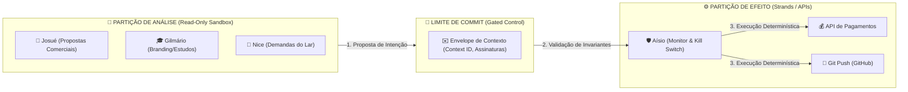

# INTEGRAÇÃO DE TECNOLOGIAS DE GOVERNANÇA (AGCP, COMMIT LIMIT & SFT)

Este documento descreve como os conceitos do **AI Governance Control Plane (AGCP)**, a **Arquitetura do Limite de Commit (Commit Limit)** e as tecnologias da **Sustainable Future Tech (SFT)** se aplicam na prática aos agentes do ecossistema **BRACHÁT**.

---

## 1. Mapeamento Arquitetônico: Separação de Privilégios

Adotamos a separação rigorosa entre a **Partição de Análise** (onde reside o raciocínio das IAs) e a **Partição de Efeito** (onde ocorrem as ações reais), eliminando riscos de execução descontrolada ou *jailbreaks*.

### A. Partição de Análise (Analysis Partition)
* **Agentes:** Josué (`DIR_JOSUE_001`), Gilmário (`DIR_GILMARIO_001`), Nice (`NICE_001`) e Jéssica (`DIR_JESSICA_001`) quando processam linguagem natural.
* **Característica:** Operam dentro de um sandbox em regime *Read-Only*. Eles **não têm credenciais de escrita** em bancos de dados reais ou APIs de pagamento. Eles apenas formulam a **intenção (Proposal)** de realizar uma ação.
* **Benefício:** Se Josué sofrer uma injeção de prompt ou jailbreak, o impacto está contido. Ele pode gerar uma proposta maliciosa, mas nunca executá-la diretamente.

### B. Partição de Efeito (Effect Partition)
* **Agentes:** Aísio (`DIR_AISIO_001`) e os **Strands Workers** determinísticos.
* **Característica:** Possuem privilégios de escrita (APIs financeiras, Git Push, disparadores de e-mail). Operam de forma puramente determinística baseada em código e regras estritas, rejeitando qualquer entrada probabilística de LLM.
* **Benefício:** Garante precisão matemática e conformidade absoluta com as regras corporativas.

---

## 2. Aplicação do Limite de Commit (Commit Limit)

O **Limite de Commit** é a fronteira física e lógica onde a análise vira efeito. Para cruzar essa fronteira no BRACHÁT, aplicamos os 3 Invariantes Determinísticos de Willis:

### I. Invariante de Rastreabilidade (Traceability)
* **Como se aplica:** Toda proposta de ação (ex: Josué propondo o envio de um contrato) deve gerar um **Envelope de Contexto** contendo o `context_id` correspondente, referências de políticas ativas e o motivo da decisão. Esses dados são salvos de forma imutável na partição do **Mem0** antes de a ação ser validada.

### II. Invariante de Co-assinatura Humana (HITL)
* **Como se aplica:** Ações que afetam ativos críticos ("Crown Jewels") não passam do Limite de Commit sem assinatura humana:
  * **Comercial (Fábio/CEO):** Qualquer proposta de pagamento acima de R$ 500 formulada pelo gerente financeiro do Josué fica retida no gateway até que o CEO Fábio assine digitalmente.
  * **Doméstico (Dona Lu):** Qualquer compra doméstica acima de R$ 100 sugerida pela Nice exige o aval explícito de Dona Lu.

### III. Invariante de Proveniência e Identidade
* **Como se aplica:** Cada agente possui uma assinatura forte atestada no Registry (Registry-bound ICAM). O Hermes valida se a mensagem recebida é de fato originária do agente declarado, impedindo ataques de personificação (spoofing).

---

## 3. Integração com Sistemas SFT e Mem0

### A. QILIS (Explicabilidade e Ledger de Decisões)
* **Aplicação no BRACHÁT:** Em vez do NotebookLLM, usamos a infraestrutura do **Mem0** para criar o *Decision Ledger* (Livro de Decisões). Toda vez que Jéssica ou Josué propõem um fluxo de alta sensibilidade, a árvore de decisão (reasoning path) é persistida no Mem0. Durante a auditoria em dupla no Mac, Fábio e Antigravity utilizam esses registros para auditar a causalidade de cada comportamento.

### B. AGCP (AI Governance Control Plane) e Aísio
* **Aplicação no BRACHÁT:** Aísio atua como a interface do Control Plane do AGCP em tempo real:
  1. Ele monitora a fila de mensagens do Hermes.
  2. Executa verificações automáticas de limites de domínio (Zero Trust Checkpoint). Se a Nice tentar consultar dados do escopo `jessica_legal` ou `josue_ops`, a mensagem é barrada imediatamente (violação de política de isolamento).
  3. Controla a integridade de runtime: em caso de anomalia de segurança, Aísio dispara a rotina de congelamento de chaves (Kill Switch) e reverte o estado do repositório Git local para a última versão estável (Rollback).
