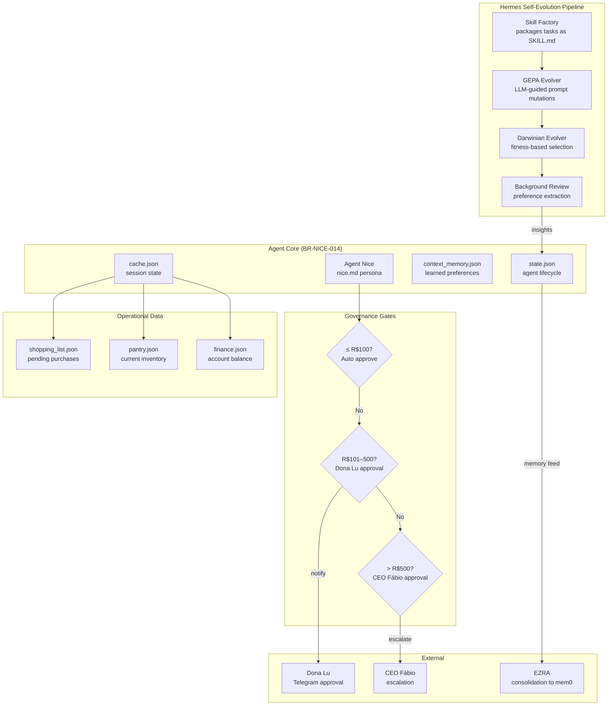
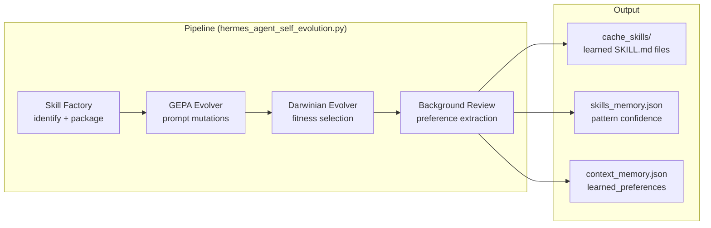

# Agent Nice — Household Governance Agent

**Runtime governance for domestic operations with self-evolution, approval gates, and kashrut compliance.**

## What It Does

Agent Nice is a domestic governance agent that manages household tasks with the same rigor as enterprise AI systems. It enforces financial approval gates, kashrut dietary compliance, and self-evolves through a 4-stage learning pipeline (Hermes Agent).

## Architecture



## How It Works

1. **CHECK** — Reads `cache.json` and all integration files (shopping, pantry, finance).
2. **SKILL CACHE** — Retrieves needed skills from `shared/general_skills/` and copies to `cache_skills/`.
3. **PLAN** — Organizes agenda, checks commitments, verifies pantry, compares prices.
4. **KASHRUT CHECK** — Audits grocery items for banned substances (carmine/E120, pork, bacon, ham, gelatin). Strictly blocks or warns.
5. **DECIDE & CONTACT** — Applies financial heuristics. Contacts Dona Lu or CEO as needed.
6. **LOG** — Registers expenses and tasks in `cache.json` and internal JSON files.

## Hermes Self-Evolution



### Components

| Component | Purpose |
|-----------|---------|
| **Skill Factory** | Identifies repeated successful tasks, packages them as `SKILL.md` with provenance |
| **GEPA Evolver** | LLM-guided prompt mutations: tone changes, constraint add/remove, example injection |
| **Darwinian Evolver** | Population of solutions with fitness scores; kills worst, mutates survivors |
| **Background Review** | Analyzes state/cache for patterns, extracts user preferences, consolidates learnings |

## Verification Levels

| Level | What It Verifies |
|-------|-----------------|
| **N1** | Agenda, calendar, and bills verified |
| **N2** | Contact with Dona Lu made and pantry checked |
| **N3** | Kashrut compliance checks executed strictly |
| **N4** | Expenses and lists registered in `cache.json` |
| **N5** | Daily summary and balance sent for accountability |

## Constraints

- **Zero-Trust**: Cannot execute financial payments directly; only organizes lists and schedules.
- **MVI Limits**: All file writes strictly <200 lines.
- **Memory Constraint**: Never loads full history from previous days.
- **Max Context**: 2K tokens per session.
- **Forbidden**: Any task not described in `nice.md`.

## Files

```
agent_nice/
├── nice.md                    # Agent persona and contracts
├── state.json                 # Agent lifecycle state
├── context_memory.json        # Learned preferences + system rules
├── skills_memory.json         # Hermes loop state + learned skills
├── cache.json                 # Session state
├── shopping_list.json         # Pending purchases
├── pantry.json                # Current inventory
├── finance.json               # Account balance
├── receipts/                  # Expense receipts
└── hermes_agent/
    ├── hermes_agent_self_evolution.py  # Pipeline orchestrator
    ├── skill_factory.py                # Task → SKILL.md packaging
    ├── gepa_evolver.py                 # LLM-guided prompt evolution
    ├── darwinian_evolver.py            # Fitness-based population evolution
    ├── background_review.py            # Preference extraction
    ├── population/                     # Evolution population data
    └── reviews/                        # Background review logs
```

## Tech Stack

- **Language**: Python
- **Model**: custom-proxy/big-pickle (temperature: 0)
- **Persistence**: JSON files (state, cache, memory)
- **Governance**: Financial approval gates, kashrut compliance, MVI limits
- **Self-Evolution**: Hermes Agent (4-stage pipeline)
