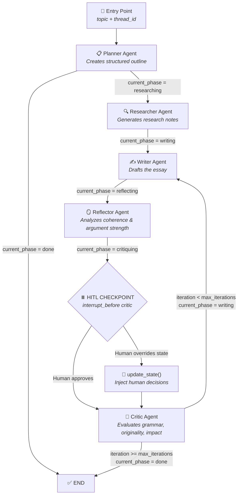

<h1 align="center">✍️ Multi-Agent Essay Creator</h1>

<p align="center">
  <em>A stateful, multi-agent orchestration system powered by LangGraph that autonomously plans, researches, writes, reflects, and critiques essays — with full human-in-the-loop control.</em>
</p>

<p align="center">
  
  
  
  
  
  
</p>

---

## Overview

This project implements a **multi-agent essay generation pipeline** where five specialized AI agents collaborate in a cyclic workflow to produce high-quality, iteratively refined essays. Each agent owns a single responsibility — planning, researching, writing, reflecting, or critiquing — and the system loops through write→reflect→critique cycles until the essay reaches a configurable quality threshold.

The system is **not amnesic**: every state transition is persisted to a SQLite database via LangGraph checkpointers, keyed by `thread_id`. A human can **pause execution** before the Critic node, inspect a full state snapshot, inject overrides, and resume — making this a true **Human-in-the-Loop (HITL)** architecture.

---

## Architecture & Decision Flow



| Step | Agent | Input | Output | Phase Transition |
|------|-------|-------|--------|-----------------|
| 1 | **Planner** | Raw topic | Structured outline (title, thesis, arguments, conclusion) | `planning` → `researching` |
| 2 | **Researcher** | Topic + Plan | Research notes with facts, data, references | `researching` → `writing` |
| 3 | **Writer** | Plan + Research + Previous critique | Full essay draft | `writing` → `reflecting` |
| 4 | **Reflector** | Current draft | Coherence analysis, argument strength, suggestions | `reflecting` → `critiquing` |
| 5 | **Critic** | Draft + Reflection | Score (1-10), grammar/style analysis, originality | `critiquing` → `writing` (loop) or `done` |

---

## Features

- 🧠 **Multi-Agent Orchestration**: Five specialized agents with distinct roles, orchestrated via LangGraph conditional edges — no monolithic prompt doing everything.
- 💾 **SQLite Persistence with Checkpointers**: Every state transition is atomically saved to a SQLite database (`SqliteSaver`). The system uses `thread_id` to isolate sessions — closing and reopening the app preserves the full conversation history.
- ⏸️ **Human-in-the-Loop (HITL)**: The graph is compiled with `interrupt_before=["critic"]`, pausing execution before the Critic node. A human can snapshot the state, override any field, and resume execution with the modified state.
- 🔄 **Iterative Refinement Loop**: The Writer→Reflector→Critic cycle repeats `max_iterations` times, with each Critic's feedback injected into the next Writer draft — simulating real editorial workflows.
- 🧩 **Custom Message Reducer (`reduce_messages`)**: Instead of LangGraph's default `operator.add`, the `AgentState` uses a custom reducer that **merges messages by ID**. This allows human `update_state()` calls to **replace** existing messages in-place, not just append duplicates.
- 📸 **State Snapshots**: The `get_snapshot()` function captures the complete agent state — variables, thread ID, timestamp, and full message history — as a photograph of the agent at any pause point.
- 🖥️ **Gradio Interface**: Three-tab UI for creating essays, applying HITL overrides, and inspecting state snapshots — all without touching the terminal.

---

## AgentState

| Key | Type | Description |
|-----|------|-------------|
| `topic` | `str` | The essay topic provided by the user |
| `messages` | `Annotated[list[BaseMessage], reduce_messages]` | Full conversation history with ID-based deduplication |
| `draft` | `str` | The current essay draft (updated each Writer iteration) |
| `research_notes` | `str` | Research output from the Researcher agent |
| `critique` | `str` | Critic's evaluation (score + analysis) — fed back to Writer |
| `reflection` | `str` | Reflector's coherence and argument analysis |
| `planner_output` | `str` | Structured outline from the Planner agent |
| `current_phase` | `Literal["planning","researching","writing","reflecting","critiquing","done"]` | Controls conditional edge routing |
| `iteration` | `int` | Current write-reflect-critique cycle count |
| `max_iterations` | `int` | Maximum cycles before forced termination |
| `thread_id` | `str` | Unique session identifier for SQLite isolation |

---

## Getting Started

### Prerequisites
- Python 3.11+
- A Google Gemini API key ([Get one here](https://aistudio.google.com/app/apikey))

### 1. Clone & Setup
```bash
git clone https://github.com/your-username/essay-creator.git
cd essay-creator
python3 -m venv .venv
source .venv/bin/activate   # macOS/Linux
```

### 2. Install Dependencies
```bash
pip install langchain-google-genai langgraph langgraph-checkpoint-sqlite langchain-core gradio pytest
```

### 3. Configure Environment
```bash
echo "GOOGLE_API_KEY=your_gemini_api_key_here" > .env
```

### 4. Run Tests
```bash
python -m pytest tests/ -v
```

### 5. Launch the Interface
```bash
cd src
python -m essay_creator.app
```
The Gradio interface will open at `http://localhost:7860` with three tabs:
- **📝 Create Essay** — Enter a topic and generate
- **🔄 HITL Override** — Pause and inject human decisions
- **📸 Snapshot** — Inspect the full agent state at any point

---

## Project Structure
```
essay-creator/
├── src/essay_creator/
│   ├── __init__.py          # Package exports
│   ├── state.py             # EssayState TypedDict + reduce_messages
│   ├── agents.py            # 5 agent nodes (Planner, Researcher, Writer, Reflector, Critic)
│   ├── workflow.py          # LangGraph graph builder + HITL functions
│   └── app.py               # Gradio interface
├── tests/test_essay.py      # 14 tests (state, reducers, workflow, agents)
├── pyproject.toml
└── requirements.txt
```

---

## How It Works — Deep Dive

### Persistence Model
```
Thread ID → SQLite Database → Checkpoint per State Transition
```
Every time an agent node returns, LangGraph's `SqliteSaver` serializes the complete `EssayState` to SQLite, tagged with the `thread_id`. You can close the process and resume later with the same `thread_id`. Multiple essays run in complete isolation (different thread IDs).

### HITL Mechanism
```python
# 1. Graph pauses before critic_node
compiled = graph.compile(checkpointer=memory, interrupt_before=["critic"])
# 2. Human inspects the snapshot
snapshot = graph.get_state(config)
print(snapshot.values["draft"])
# 3. Human overrides state
graph.update_state(config, {"critique": "Excellent draft! Minor grammar fixes needed."})
# 4. Resume from the paused point
final_state = graph.invoke(None, config)
```

### Custom Message Reducer
```python
def reduce_messages(left, right):
    """Replace messages by ID instead of appending duplicates."""
    left_map = {m.id: m for m in left}
    for msg in right:
        left_map[msg.id] = msg  # Overwrites if same ID exists
    return list(left_map.values())
```

---

## License

MIT

---

<p align="center">
  <sub>Built with LangGraph, LangChain, and Google Gemini — demonstrating advanced multi-agent orchestration with persistence and human-in-the-loop control.</sub>
</p>
