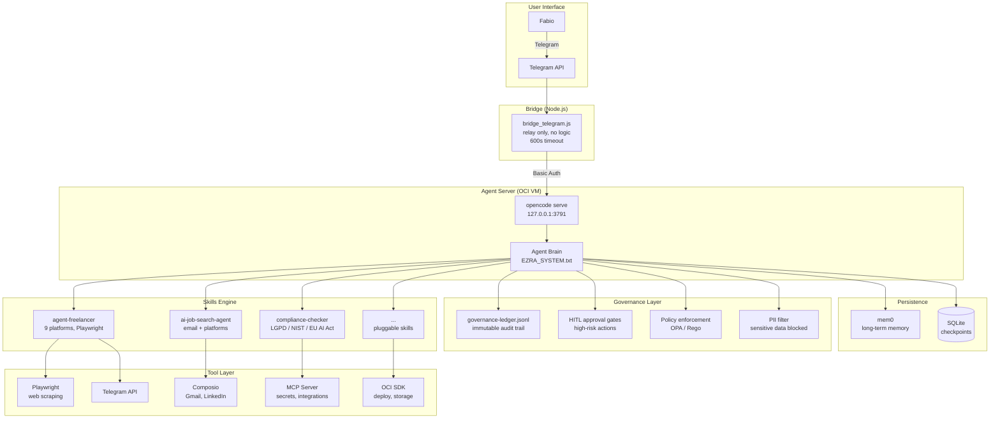
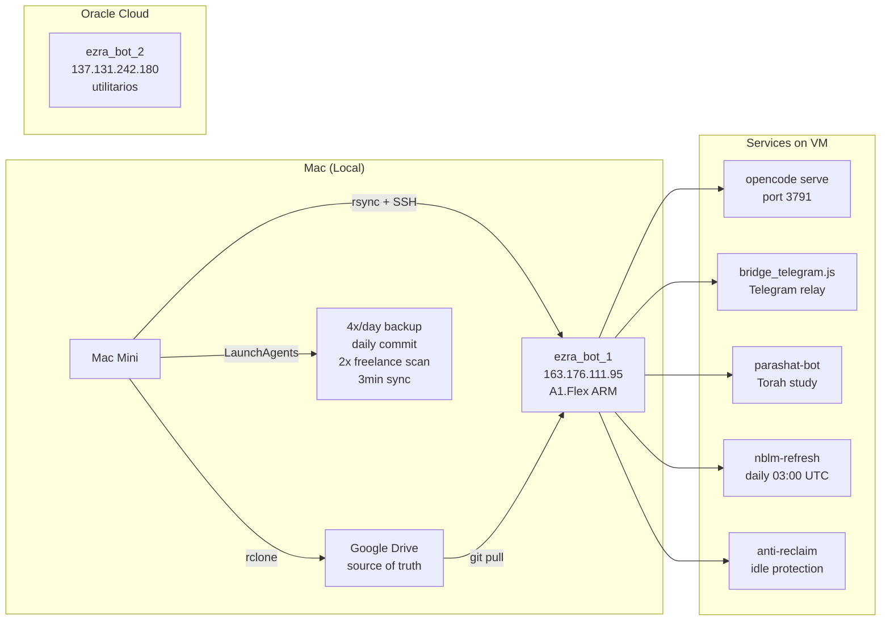
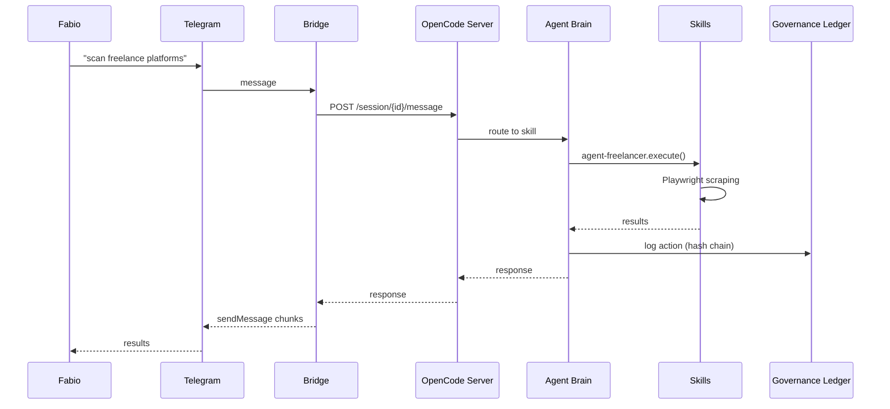

# Ezra Agent — Autonomous AI Assistant (24/7 Production)

**Personal AI agent running 24/7 on Oracle Cloud Infrastructure. Telegram interface, persistent memory, multi-skill architecture, governance built-in. Not a demo — daily driver.**

## What It Does

Ezra is a self-directed agent that plans, executes, remembers, and learns. It scans freelance platforms, manages schedules, learns from every interaction, and enforces governance on every action.

## Architecture



## Infrastructure



## Deploy Components

| Service | File | Purpose |
|---------|------|---------|
| **Ezra Brain** | `ezra-serve.service` | OpenCode serve on port 3791, auto-restart, warmup on boot |
| **Telegram Bridge** | `bridge_telegram.service` + `bridge_telegram.js` | Zero-logic relay, 600s timeout, Basic Auth to server |
| **Parashat Bot** | `parashat-bot.service` | Torah study bot, Groq + NotebookLM, daily 09:00 BRT |
| **NotebookLM Refresh** | `nblm-refresh.timer` | Daily auth cookie refresh at 03:00 UTC |
| **Anti-Reclaim** | `anti-reclaim.service` + `anti-reclaim.py` | Synthetic load to prevent OCI free-tier instance reclaim |
| **Sync Pipeline** | `sync-ezra.sh` | Mac → Drive → GitHub → VM (rsync + git push + systemctl restart) |

## Data Flow



## Security

- **Secrets**: `secrets.env` ONLY on Mac. VM uses `.env` with its own keys. Nothing in git.
- **Auth**: Basic auth (`opencode:PASSWORD`) between bridge and server.
- **Backup**: rclone → Google Drive (4x/day). Source of truth: `brachat-main` on Drive.
- **Sync**: Mac → Drive → GitHub → VM. Never edit VM directly.

## Files

```
ezra_agent/
├── README.md
├── .opencode/              # Brain config (instructions, skills, plugins, reference)
└── deploy/
    ├── ezra-serve.service          # systemd: opencode serve 24/7
    ├── bridge_telegram.js          # Telegram relay (zero logic)
    ├── bridge_telegram.service     # systemd: bridge
    ├── ezra-warmup.sh              # Post-startup warmup (sends "warm-ok")
    ├── parashat-bot.service        # systemd: Torah study bot
    ├── nblm-refresh.timer          # systemd timer: NotebookLM auth refresh
    ├── anti-reclaim.py             # Synthetic load (idle protection)
    ├── anti-reclaim.service        # systemd: anti-reclaim
    └── sync-ezra.sh               # Pipeline: Mac → Drive → GitHub → VM
```
