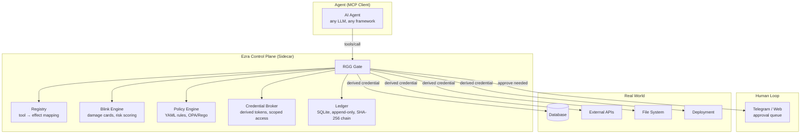
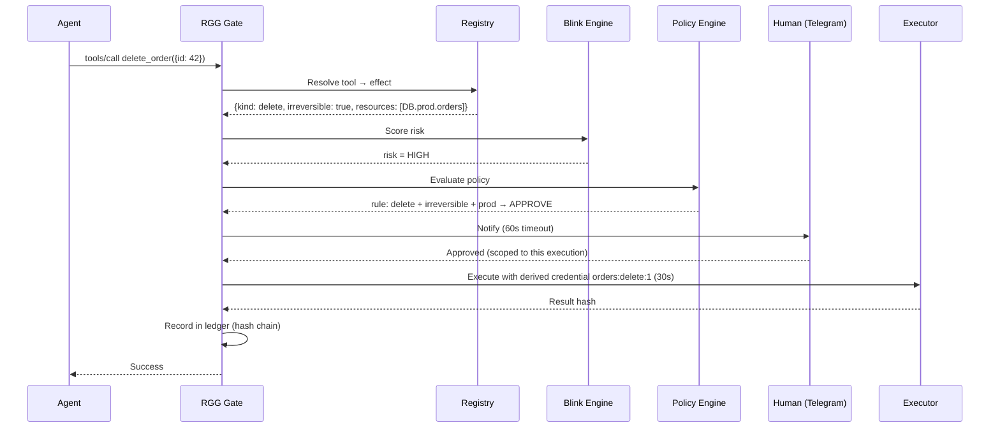

# Ezra Control Plane — Runtime Governance Gate

**Intercepts every tool call from an AI agent and decides: allow, deny, or escalate to human approval. Zero LLM in authorization decisions.**

## Problem It Solves

AI agents execute actions with real credentials (databases, deployments, email, payments). A compromised agent — through prompt injection, jailbreak, or adversarial input — executes maximum-damage actions with whatever credentials it holds.

Current solutions address pieces:
- **Guardrails** → prevent hallucination, not attacks
- **Human approval** → approval fatigue, social engineering
- **Sidecar credentials** → prevent credential theft, but not blink radius or damage measurement

The Ezra Control Plane is a **tool, not an agent**. It sits between the agent and the real world, enforcing deterministic policy on every action.

## Architecture



## How a Tool Call Flows



## Blink Radius (Damage Cards)

Every credential has a pre-computed damage card:

| Credential | Effect Kind | Resources | Irreversible | Max Damage |
|-----------|-------------|-----------|--------------|------------|
| DB read | read | DB.* | No | None |
| DB write | write | DB.* | No | Partial |
| DB delete | delete | DB.prod.orders | Yes | all_orders |
| API transfer | transfer | payments.* | Yes | max_balance |
| Deploy | exec | prod.* | No | service_down |

When a tool call is intercepted, the damage card determines:
- **Risk score** (low/medium/high/critical)
- **Policy path** (allow/deny/approve)
- **Derived credential scope** (what can this execution touch)
- **Rate limits** (anti-drip: max N destructive actions per window)

## Policy Rules (YAML)

```yaml
rules:
  - id: delete-irreversible-prod
    match:
      kind: delete
      irreversible: true
      resources: ["DB.prod.*"]
    action: approve
    escalate: true

  - id: read-any
    match:
      kind: read
    action: allow

  - id: drip-delete
    match:
      kind: delete
      window: 1h
      count: 50
    action: deny
    reason: "Drip attack detected: too many deletes in window"

  - id: transfer-low
    match:
      kind: transfer
      max_damage: "<=100"
    action: allow
```

## What It Is NOT

- Not a network firewall or DLP
- Not protecting the control plane itself (assumes trusted host)
- Not removing the need for correct credentials on the real tool
- Not eliminating human review — it reduces frequency of approval requests

## Data Model

```
tool_call     { id, agent_id, tool, args, ts, nonce }
effect        { id, kind, resources[], irreversible, max_damage, cost }
decision      { id, tool_call_id, outcome: allow|deny|approve, reason, rule_id }
execution     { decision_id, credential_scope, result_hash, executor }
ledger_entry  { block_id, prev_hash, tool_call, effect, decision, execution }
policy        { id, version, rules[] }
credential    { id, name, scope, damage_card, holder: gate_only }
```

## API

| Endpoint | Method | Purpose |
|----------|--------|---------|
| `/call` | POST | Execute tool call through gate |
| `/policies` | GET/PUT | List/update policy rules |
| `/ledger?since=` | GET | Query audit evidence |
| `/approve/{id}` | POST | Approve pending decision |
| `/deny/{id}` | POST | Reject with reason |
| `/credentials` | POST | Register credential + damage card |
| `/blink/{credential}` | GET | Get damage card for credential |
| `/risk/{tool_call}` | GET | What-if risk score (no execution) |

## Roadmap

| Phase | Scope |
|-------|-------|
| **Phase 0** | Registry + Policy Engine + Ledger, dry-run mode, demo with fake delete_order |
| **Phase 1** | Real MCP server (intercept + forward), Credential Broker with scope, Blink Engine |
| **Phase 2** | Human loop via Telegram, anti-drip, escalation |
| **Phase 3** | Connect to real agent (Ezra) in observe mode, public demo |
| **Phase 4** | Executor sandbox, ledger replay tool, compliance reports |

## Success Criteria

- Demo: (1) legitimate action passes, (2) "compromised" agent drip-deletes 1000 records → blocked by rate + scope + threshold
- Portfolio: spec + demo become case study for "AI Governance Lead" positioning
- Zero LLM in authorization decisions (verifiable determinism)

## Design Principles

1. **Non-bypassable** — every agent action goes through the gate, no alternative path
2. **Deterministic enforcement** — authorization decided by code, not LLM
3. **Dynamic least privilege** — derived credential per task, not fixed per process
4. **Known blink radius** — every credential has a pre-computed damage card
5. **Replayable evidence** — immutable, reproducible audit trail
6. **Fail closed** — if gate cannot decide, deny
7. **Human approval only when risk exceeds threshold** — never for maximum risk
