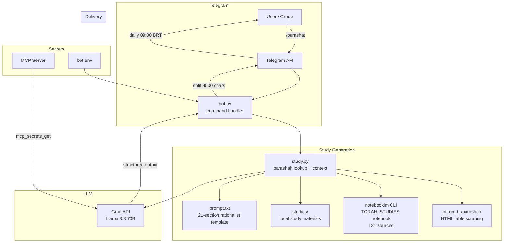

# Parashat Bot — Weekly Torah Study (Telegram)

**Telegram bot that generates rationalist Jewish Torah studies from the weekly parashah, combining web scraping, NotebookLM RAG, and Groq LLM.**

## What It Does

Sends weekly Torah studies to a Telegram group. Fetches parashah data from btf.org.br, enriches it with NotebookLM sources (131 sources in TORAH_STUDIES notebook), and generates a 21-section rationalist analysis using Groq (Llama 3.3 70B).

## Architecture



## How It Works

1. **FETCH** — Scrapes `btf.org.br/parashot/` for parashah table (date, name, Torah, Haftarah, etc.)
2. **LOOKUP** — Finds parashah by name, date, or next upcoming
3. **CONTEXT** — Enriches with:
   - NotebookLM TORAH_STUDIES notebook (131 sources, cited with `[1][2]`)
   - Local study materials from `studies/` directory
4. **PROMPT** — 21-section rationalist template (Maimonides, Ibn Ezra, Saadia Gaon, Gersonides, Espinosa, Aristotle, Yeshua)
5. **GENERATE** — Groq Llama 3.3 70B produces structured analysis
6. **DELIVER** — Splits into 4000-char Telegram chunks, sends to group

## Rationalist Framework

The prompt enforces a 21-section structure per study:

| Section | What It Covers |
|---------|---------------|
| 1–6 | Text, historical context, grammar, lexicon, logic, problem |
| 7–8 | Universal principle taught |
| 9–13 | Maimonides, Ibn Ezra, Saadia Gaon, Gersonides, Espinosa |
| 14–15 | Aristotle (ethics of means), Yeshua (universal law) |
| 16–20 | Author comparison, divergences, consensus, contemporary application, limits |
| 21 | Conclusion |

**6 axioms enforced**: Unity of truth, Tanakh self-interpretation, absolute disanthropomorphism, universal lens of Yeshua, purpose of mitzvot, validity of reason.

## Commands

| Command | Action |
|---------|--------|
| `/start` | Welcome message with usage instructions |
| `/parashat <name or date>` | Generate study for specific parashah |
| `/parashat` (no args) | Generate study for this week's parashah |
| Any text message | Treated as parashah query |

## Files

```
parashat_bot/
├── bot.py              # Telegram bot (handlers, polling, daily job)
├── study.py            # Parashah lookup, context building, NotebookLM integration
├── mcp_client.py       # MCP client for secret retrieval (GROQ_API_KEY)
├── prompt.txt          # 21-section rationalist study template (176 lines)
├── requirements.txt    # python-telegram-bot, openai, requests, bs4, tzdata
├── bot.env.example     # PARASHAT_TELEGRAM_API_KEY, GROQ_API_KEY, LLM_MODEL
├── parashat-bot.service # systemd service
├── studies/            # Local study materials (markdown/txt)
└── README.md
```

## Setup

```bash
python3 -m venv venv && venv/bin/pip install -r requirements.txt
cp bot.env.example bot.env  # fill keys
sudo cp parashat-bot.service /etc/systemd/system/ && sudo systemctl enable --now parashat-bot
```

## Tech Stack

- **Bot**: python-telegram-bot 21.10
- **LLM**: Groq API (Llama 3.3 70B Versatile) via OpenAI SDK
- **RAG**: NotebookLM CLI (notebooklm-py 0.8.0, 131 sources)
- **Scraping**: requests + BeautifulSoup (btf.org.br)
- **Secrets**: MCP server (mcp_secrets_get)
