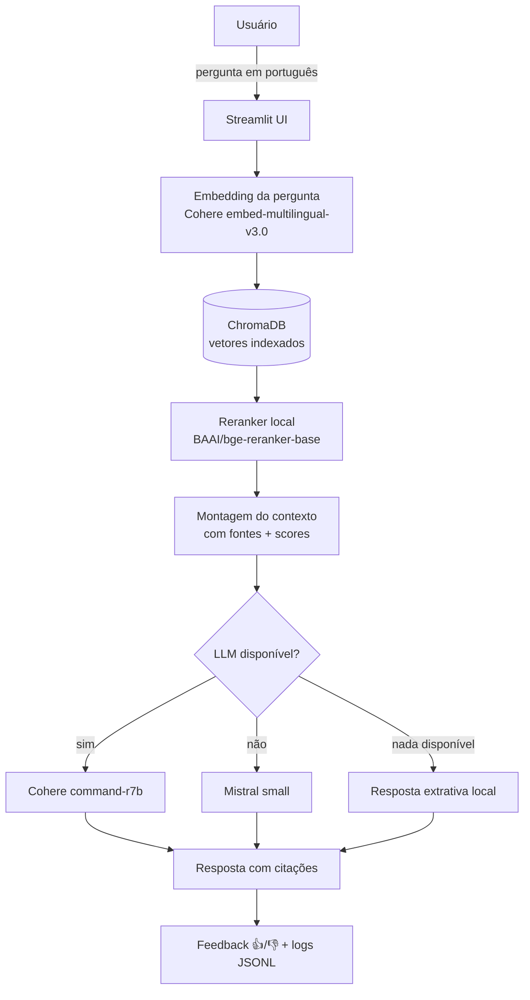
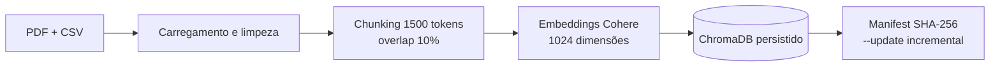
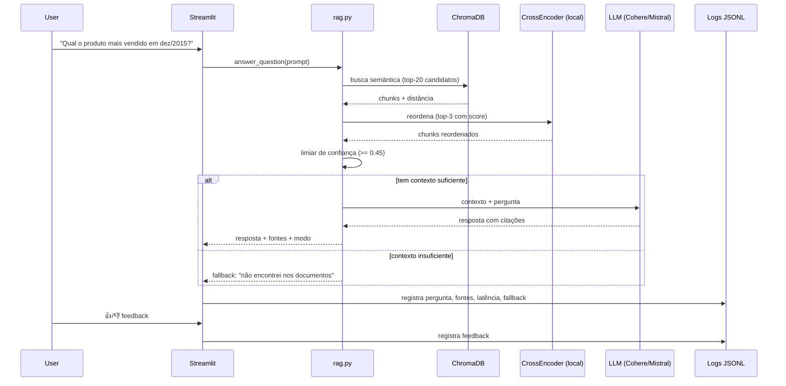
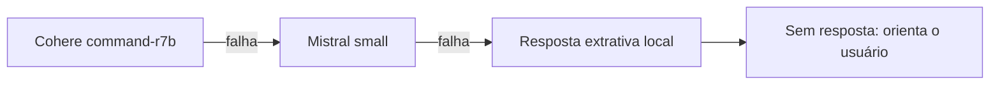
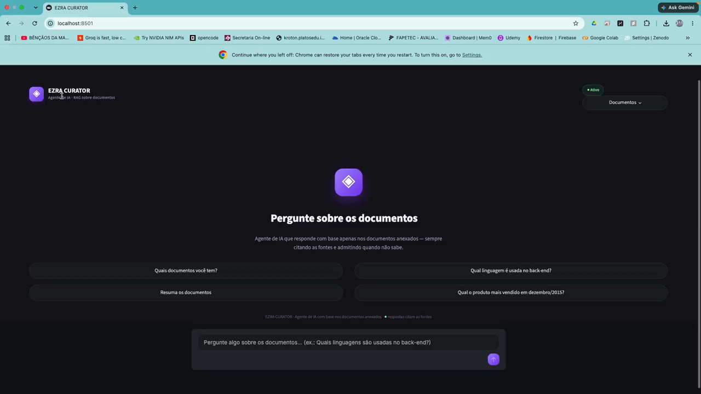

# 🦅 EZRA_CURATOR [▶️ Watch Demo](./docs/video_app_compressed.mp4)


### Agente RAG corporativo · Santos EZRA_CURATOR Soluciones


> Agente de IA que responde perguntas de colaboradores com base em documentos internos da empresa — recuperando evidências reais e citando as fontes. Construído para o **Challenge Oracle ONE — FASE TECH**.

---

## 📑 Índice

1. [O que é](#-o-que-é)
2. [Como funciona (arquitetura)](#-como-funciona-arquitetura)
3. [Fluxo real de uma pergunta](#-fluxo-real-de-uma-pergunta)
4. [Tecnologias e ferramentas](#-tecnologias-e-ferramentas)
5. [Funcionalidades](#-funcionalidades)
6. [Fallbacks (resiliência)](#-fallbacks-resiliência)
7. [Estrutura do projeto](#-estrutura-do-projeto)
8. [Contratos e interfaces](#-contratos-e-interfaces)
9. [Como executar localmente](#-como-executar-localmente)
10. [Testes e avaliação](#-testes-e-avaliação)
11. [Execução (evidência)](#-execução-evidência)
12. [Deploy na OCI](#-deploy-na-oci)
13. [Para que pode servir](#-para-que-pode-servir)
14. [Escalabilidade](#-escalabilidade)
15. [Roadmap](#-roadmap)
16. [Autor e contato](#-autor-e-contato)

---

## 🧠 O que é

O **EZRA_CURATOR** é um **agente de RAG (Retrieval-Augmented Generation)** que responde perguntas em linguagem natural com base nos documentos internos da empresa. Ele:

- 🔍 **Recupera** os trechos mais relevantes de um banco vetorial (ChromaDB).
- 🎯 **Reordena** os resultados com um reranker local (cross-encoder).
- 🤖 **Gera** a resposta com um LLM em nuvem (Cohere), **citando as fontes**.
- 🛡️ **Nunca inventa**: se a resposta não está nos documentos, ele diz que não encontrou e orienta o usuário.
- 💬 **Conversa de forma natural**, sempre guiando o usuário de volta aos documentos disponíveis.

**Pergunta de exemplo:**

> "Quais linguagens de programação são usadas no back-end?"

> "De acordo com o contexto fornecido, o back-end da Santos EZRA_CURATOR Soluciones é baseado em **Java 17+ e Spring Boot 3+** [Guia_Engenharia_Backend.pdf]."

---

## 🏗️ Como funciona (arquitetura)



**Ingestão dos documentos:**



---

## 🔄 Fluxo real de uma pergunta



---

## 🛠️ Tecnologias e ferramentas

| Camada | Tecnologia | Para que serve |
|---|---|---|
| Linguagem | **Python 3.11+** | Backend, ingestão e pipeline RAG |
| Interface | **Streamlit** | Chat web com fontes, feedback e métricas |
| Orquestração | **LangChain** | Cadeia de recuperação e geração |
| Embeddings | **Cohere embed-multilingual-v3.0** | Vetores semânticos multilingue (1024 dims) |
| Banco vetorial | **ChromaDB** | Persistência e busca por similaridade (cosine) |
| LLM principal | **Cohere command-r7b-12-2024** | Geração de respostas com citação |
| LLM fallback | **Mistral mistral-small-latest** | Continuidade quando o principal falha |
| Reranker | **BAAI/bge-reranker-base (local)** | Reordenação fina dos candidatos |
| Extração de PDF | **pypdf** | Texto nativo dos documentos |
| Dados tabulares | **pandas** | Leitura de CSV (vendas) |
| Logs | **JSONL (python)** | Auditoria, rastreabilidade e feedback |
| Avaliação | **tests/eval.py** | Medição de acurácia (8/8) |
| Deploy | **Docker + docker-compose** | Container da aplicação |
| Nuvem (prevista) | **Oracle Cloud Infrastructure** | A1.Flex, Object Storage, Vault |

---

## ✨ Funcionalidades

- 💬 **Chat conversacional** com histórico por sessão.
- 📄 **Fontes citadas** em cada resposta (arquivo · categoria · score).
- 🛡️ **Respostas honestas**: recusa quando não há evidência, sem alucinar.
- 🔁 **Fallbacks automáticos** (LLM e embeddings) — ver seção abaixo.
- 📊 **Métricas ao vivo**: documentos, chunks, modelo, latência real da resposta.
- 🛡️ **Status do sistema exibido na interface** (modo ativo/degradado + provedor ativo).
- ⚡ **Perguntas rápidas** para demonstrar o agente.
- 🎨 **Tema dark premium**: fundo `#121218` + letras violeta `#a78bfa`/roxo `#7c3aed`, fontes unificadas (Inter).
- 👍/👎 **Feedback do usuário** gravado em log.
- 📈 **Dashboard de análise** (`scripts/dashboard.py`): perguntas sem resposta, latência média, fallbacks acionados, feedbacks negativos.
- 🔄 **Atualização incremental** dos documentos por hash SHA-256 (`--update`).
- 📄 **Upload de documentos na interface** (PDF e CSV).

---

## 🛡️ Fallbacks (resiliência)

Cadeia de geração — **Cohere → Mistral → resposta extrativa local**:



- **LLM**: cada provedor que falha é pulado automaticamente na mesma sessão (cache de falhas) — sem repetir chamadas inúteis. A cadeia atual no código é `Cohere → Mistral → Anthropic → resposta extrativa local` (configurada via `LLM_PROVIDER` no `.env`).
- **Embeddings**: Cohere → **modelo local** (`EMBEDDING_FALLBACK`; padrão MiniLM-L12, `.env` atual usa `bge-m3`).
- **Reranker**: se o cross-encoder local não carregar, usa apenas a ordenação por similaridade.
- **Fora do escopo**: saudação, apresentação e "quais documentos" são respondidos por um **roteador conversacional** que guia o usuário para os documentos.

O **estado do sistema é exibido na interface** (modo normal/degradado + provedor ativo), e o log registra qual fallback foi usado em cada resposta.

---

## 📁 Estrutura do projeto

```
EZRA_CURATOR/
├── app/
│   ├── app.py           # Streamlit (UI) — tema dark premium
│   ├── rag.py           # pipeline RAG: recuperação + rerank + geração + fallbacks
│   ├── loaders.py       # carregamento PDF/CSV + chunking + metadados
│   ├── ingest.py        # indexação vetorial + manifest (--update)
│   ├── config.py        # configuração por variáveis de ambiente
│   ├── embeddings.py    # provedores de embeddings + fallback
│   ├── manifest.py      # hash SHA-256 dos documentos
│   └── logging.py       # logs JSONL (auditoria)
├── data/                # documentos-fonte (não versionado)
├── docs/                # spec challenge_oracle.md + redesign da UI
├── scripts/             # gen_vendas, dashboard, tradução de PDFs
├── tests/               # eval set + eval.py (avaliação)
├── logs/                # queries_*.jsonl (execução)
├── .streamlit/config.toml
├── .env.example
├── Dockerfile
├── docker-compose.yml
├── requirements.txt
└── README.md
```

---

## 📋 Contratos e interfaces

### Variáveis de ambiente (`.env`)

| Variável | Padrão | Descrição |
|---|---|---|
| `LLM_PROVIDER` | `cohere` | Provedor LLM principal |
| `LLM_MODEL` | `command-r7b-12-2024` | Modelo principal |
| `COHERE_API_KEY` | — | Chave do LLM/embeddings principal |
| `MISTRAL_API_KEY` | — | Chave do fallback de LLM |
| `EMBEDDING_PROVIDER` | `cohere` | Provedor de embeddings |
| `EMBEDDING_MODEL` | `embed-multilingual-v3.0` | Modelo de embeddings |
| `EMBEDDING_FALLBACK` | `sentence-transformers/paraphrase-multilingual-MiniLM-L12-v2` | Fallback local |
| `CONFIDENCE_THRESHOLD` | `0.45` | Limiar de similaridade p/ aceitar contexto |
| `TOP_K` / `RERANK_TOP_K` | `5` / `3` | Candidatos e reordenação |
| `DATA_INCLUDE` | — | Filtro de arquivos a indexar |
| `VECTOR_DB_DIR` | `./chroma` | Persistência vetorial |
| `LOG_DIR` | `./logs` | Logs JSONL |

### Contrato da resposta (`RagResult`)

| Campo | Tipo | Descrição |
|---|---|---|
| `answer` | `str` | Resposta gerada |
| `sources` | `list[dict]` | Fontes citadas (arquivo, categoria, score) |
| `found` | `bool` | Se houve evidência suficiente |
| `provider` / `model` | `str` | Provedor/modelo que respondeu |
| `fallback` | `str` | Qual fallback foi acionado (se houve) |

### Contrato do log (JSONL)

```json
{"timestamp": "...", "question": "...", "chunks": [...], "sources": [...],
 "answer": "...", "latency_ms": 812.4, "provider": "cohere",
 "model": "command-r7b-12-2024", "found": true, "fallback": null, "feedback": null}
```

---

## 🚀 Como executar localmente

```bash
# 1. ambiente
python -m venv venv && source venv/bin/activate
pip install -r requirements.txt

# 2. configuração
cp .env.example .env   # preencha COHERE_API_KEY e MISTRAL_API_KEY

# 3. indexar os documentos (PDF/CSV de data/)
python -m app.ingest              # ingestão completa
python -m app.ingest --update     # incremental (só o que mudou)

# 4. rodar a interface
streamlit run app/app.py
# abra http://localhost:8501
```

---

## 🧪 Testes e avaliação

Eval set com perguntas reais dos documentos + casos fora de escopo:

```bash
python tests/eval.py              # roda os 8 itens
python tests/eval.py --limit 4    # só os 4 primeiros
```

| Resultado | Métrica |
|---|---|
| Eval set | **8 itens** (6 dentro do escopo + 2 fora) |
| Execução | `python tests/eval.py` (requer chaves de API no `.env`) |
| Relatório | `logs/eval_<timestamp>.json` |

---

## 🎬 Execução (evidência)

Vídeo da aplicação rodando — perguntas respondidas com base nos documentos, fontes citadas e layout dark:

[▶️ Assista ao vídeo de execução](docs/video_app.mp4)



> O app roda via Docker (`docker compose up -d`) na porta `8501`.

---

## ☁️ Deploy na OCI

> **Status:** artefatos prontos (Dockerfile + docker-compose); deploy previsto ao final de todas as fases.

```bash
# na instância OCI A1.Flex (ARM, free tier)
docker compose up -d --build
# segredos via OCI Vault (nunca em imagem ou git)
# documentos via Object Storage (bucket privado)
```

Pré-requisitos (Fase 9): VCN + subnet pública, instância A1.Flex, Docker, Vault (segredos), Object Storage (PDFs), validação `curl 200` + evidências (prints/vídeo).

---

## 🎯 Para que pode servir

O padrão RAG demonstrado aqui é um **cérebro corporativo reutilizável**:

- 🏢 **Portal de colaboradores**: onboarding, políticas, benefícios, RH — respostas instantâneas sem ticket.
- 🛒 **Comércio**: análise de vendas em linguagem natural (produtos, categorias, períodos).
- 🎓 **Educação**: tutor que responde com base no material do curso, citando a fonte.
- ⚖️ **Jurídico/Compliance**: consulta a contratos e normas com evidência auditável.
- 🏥 **Saúde**: protocolos e manuais com recusa segura quando não há evidência.
- 🧑‍💻 **TI/Engenharia**: guias técnicos, runbooks e documentação acessíveis por chat.

O que torna a solução confiável: **cada resposta cita a fonte, e o agente admite quando não sabe** — requisito essencial em qualquer uso profissional.

---

## 📈 Escalabilidade

Como evoluir de demo mínima para produção:

1. **Mais documentos — PDF e CSV** — basta copiar arquivos para `data/` ou enviar pela interface: o loader **detecta o tipo automaticamente** (extensão + conteúdo/magic bytes), extrai, gera embeddings e o agente passa a operar sobre ele, sem código novo. Formatos suportados hoje: **PDF, CSV** (a arquitetura de loaders permite adicionar novos formatos).
2. **Mais dados** — ChromaDB escala para milhões de chunks; usar filtros por categoria/metadata.
3. **Multi-idioma** — os embeddings Cohere são multilingue (PT/ES/EN).
4. **LLMs maiores** — a cadeia aceita novos provedores com 5 linhas de código (`_llm_factories`).
5. **Observabilidade** — logs JSONL já alimentam dashboards; adicionar métricas (Prometheus) e alertas.
6. **CI/CD** — GitHub Actions ou `deploy_oci.sh` para entrega contínua na OCI.
7. **Multi-usuário** — Streamlit por sessão; migrar para FastAPI + front-end se necessário.
8. **Atualização incremental** — manifest SHA-256 já evita reindexar tudo (`--update`).
9. **Segurança** — segredos via OCI Vault; nunca em código ou imagem.
10. **Eval contínuo** — o eval set pode crescer para centenas de casos com LLM-as-judge.

---

## 🗺️ Roadmap

| Fase | Descrição | Status |
|---|---|---|
| 1–3 | Estrutura, documentos, extração/chunking | ✅ |
| 4 | Indexação vetorial (ChromaDB + Cohere) | ✅ |
| 5–7 | RAG + geração + UI Streamlit | ✅ |
| 8 | Eval set — **8 itens definidos** (execução requer chaves no `.env`) | ✅ (set) |
| 9 | Deploy OCI (A1.Flex + Docker + Vault + Object Storage) | ⏳ previsto |
| 10 | Logs JSONL + dashboard + atualização incremental | ✅ |
| 11 | README completo (este documento) | ✅ |
| 12 | Entrega final (repo, badge, LinkedIn) | ⏳ |

---

## 👤 Autor e contato

- **Autor:** Fabio (FABIOEVERTON)
- **Projeto:** Challenge Oracle ONE — FASE TECH | Trilha ONE AI FOR TECH
- **Repositório:** projeto dentro de [`FABIOEVERTON/brachat-main`](https://github.com/FABIOEVERTON/brachat-main) → `portfolio/ezra_curator/`

---

*EZRA_CURATOR · Santos EZRA_CURATOR Soluciones · Oracle ONE Challenge — FASE TECH*
