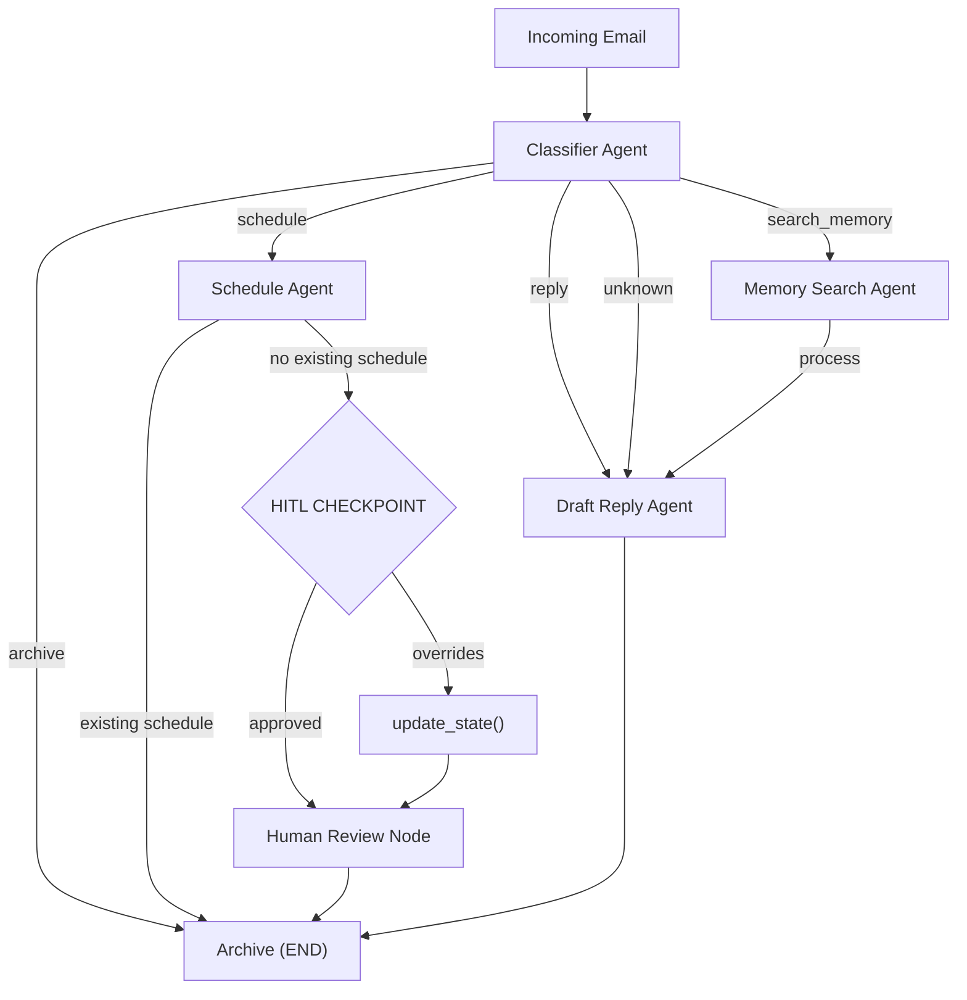
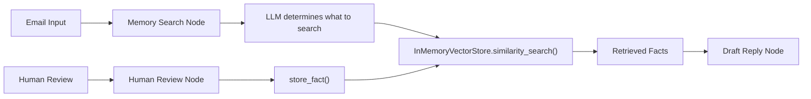

<h1 align="center">📧 Executive Email Assistant</h1>
<p align="center"><em>An AI-powered email triage and response system with semantic memory, intent-based routing, and human-in-the-loop scheduling — built with LangGraph and Google Gemini.</em></p>
<p align="center">
  
  
  
  
  
  
  
</p>

---
## Overview
This project implements an **intelligent email assistant** that autonomously classifies incoming emails by intent, routes them through specialized processing nodes, drafts professional replies, and handles meeting scheduling with human approval.

What sets this apart from simple chatbots:
- **Semantic Memory**: The assistant remembers facts across sessions using vector embeddings stored in `InMemoryVectorStore`.
- **Intent-Based Routing**: A classifier determines the email's purpose (reply, schedule, archive, search memory) and routes it through the optimal path.
- **HITL Scheduling**: Before creating a meeting, the system checks semantic memory, then pauses for human approval via `interrupt_before=["human_review"]`.
- **langmem Integration**: Tools to actively **create** and **search** memories — enabling long-term learning about user preferences.

---
## Architecture & Decision Flow


| Intent | Route | Action |
|--------|-------|--------|
| `reply` | → `draft_reply` | Generate a professional response |
| `schedule` | → `schedule` | Extract meeting details, check memory, HITL |
| `archive` | → `END` | No action needed, email is informational |
| `search_memory` | → `memory_search` → `draft_reply` | Retrieve context, then draft with that context |
| `unknown` | → `draft_reply` | Default to drafting a reply |

---
## Features
- 🧠 **Semantic Memory**: Facts and preferences embedded via `GoogleGenerativeAIEmbeddings` (text-embedding-004) stored in `InMemoryVectorStore` — search by meaning, not keywords.
- 🛠️ **Tool Integration**: Six tools: `check_calendar`, `send_email`, `search_user_memory`, `store_user_fact`, `create_manage_memory_tool`, `create_search_memory_tool`
- 💾 **SQLite Persistence**: Every email gets a unique `thread_id`. State transitions checkpointed via `SqliteSaver` for session replay.
- ⏸️ **Human-in-the-Loop Scheduling**: Pauses before `human_review` — inspect snapshot, approve/modify/reject, resume.
- 🔄 **Custom Message Reducer**: Merges messages by ID, allowing `update_state()` to replace in-place rather than append.
- 📸 **State Snapshots**: `get_snapshot()` captures complete agent state at any pause point.
- 🖥️ **Gradio Interface**: Four-tab UI for processing emails, approving schedules, searching memories, and inspecting state.

---
## AgentState
| Key | Type | Description |
|-----|------|-------------|
| `email_content` | `str` | The raw email body text |
| `sender` | `str` | Email sender (name or address) |
| `subject` | `str` | Email subject line |
| `messages` | `Annotated[list[BaseMessage], reduce_messages]` | Full interaction history with ID-based deduplication |
| `intent` | `Literal["reply","schedule","archive","search_memory","unknown"]` | Classified email intent — drives routing |
| `reply_draft` | `str` | Generated reply text (if applicable) |
| `schedule_info` | `str` | Extracted meeting details (person, date, duration, purpose) |
| `memory_context` | `str` | Retrieved facts from semantic memory |
| `human_approval` | `str` | Human decision on scheduling |
| `current_phase` | `Literal["classify","process","draft_reply","schedule","human_review","done"]` | Controls conditional edge routing |
| `thread_id` | `str` | Unique session identifier for SQLite isolation |
| `needs_human` | `bool` | Flag indicating HITL intervention is required |

---
## Semantic Memory Architecture

**How Memory Works:**
1. **Embedding**: Text → vectors via `GoogleGenerativeAIEmbeddings(model="models/text-embedding-004")`
2. **Storage**: Vectors stored in `InMemoryVectorStore` with metadata (source, type, person)
3. **Retrieval**: `similarity_search()` finds most relevant facts for any query
4. **Integration**: Retrieved context injected into Writer's prompt for context-aware replies
5. **Learning**: After human-approved schedules, fact is stored back — system learns from each interaction

---
## Getting Started
### Prerequisites
- Python 3.11+
- A Google Gemini API key ([Get one here](https://aistudio.google.com/app/apikey))

### 1. Clone & Setup
```bash
git clone https://github.com/your-username/exec-email-assistant.git
cd exec-email-assistant
python3 -m venv .venv && source .venv/bin/activate
```

### 2. Install Dependencies
```bash
pip install langchain-google-genai langgraph langgraph-checkpoint-sqlite langchain-core langmem gradio pytest
```

### 3. Configure Environment
```bash
echo "GOOGLE_API_KEY=your_gemini_api_key_here" > .env
```

### 4. Run Tests
```bash
python -m pytest tests/ -v
```

### 5. Launch the Interface
```bash
cd src && python -m email_assistant.app
```
The Gradio interface opens at `http://localhost:7860` with four tabs:
- **📨 Process Email** — Enter sender, subject, and content
- **✅ Approve Schedule** — Review and approve pending meeting requests
- **🧠 Semantic Memory** — Search and store long-term facts
- **📸 Snapshot** — Inspect the full agent state

---
## Project Structure
```
exec-email-assistant/
├── src/email_assistant/
│   ├── __init__.py          # Package exports
│   ├── state.py             # EmailState TypedDict + reduce_messages
│   ├── memory.py            # SemanticMemory class (embeddings + vector store)
│   ├── tools.py             # @tool functions (calendar, email, memory)
│   ├── agents.py            # 5 agent nodes
│   ├── workflow.py          # LangGraph graph builder + HITL functions
│   └── app.py               # Gradio interface
├── tests/test_email.py      # 16 tests
├── pyproject.toml
└── requirements.txt
```

---
## How It Works — Deep Dive
### Intent Classification
The Classifier returns one of five intents — only the label, no explanations — keeping output clean for programmatic routing.

### HITL Scheduling Flow
```python
compiled = graph.compile(checkpointer=memory, interrupt_before=["human_review"])
snapshot = graph.get_state(config)
graph.update_state(config, {"human_approval": "approved"})
final_state = graph.invoke(None, config)
```

### Memory Persistence
```python
memory.store_fact("Meeting with João every Tuesday at 10am", metadata={"type": "schedule", "person": "João"})
results = memory.search_facts("reunião terça", k=3)
```

### Custom Message Reducer
```python
def reduce_messages(left, right):
    left_map = {m.id: m for m in left}
    for msg in right: left_map[msg.id] = msg
    return list(left_map.values())
```

---
## License
MIT

---
<p align="center"><sub>Built with LangGraph, LangChain, langmem, and Google Gemini — demonstrating semantic memory, intent-based routing, and human-in-the-loop control.</sub></p>
